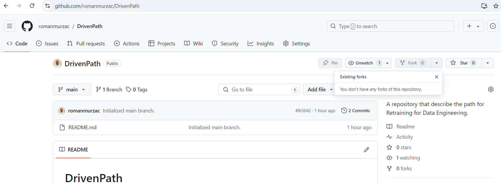
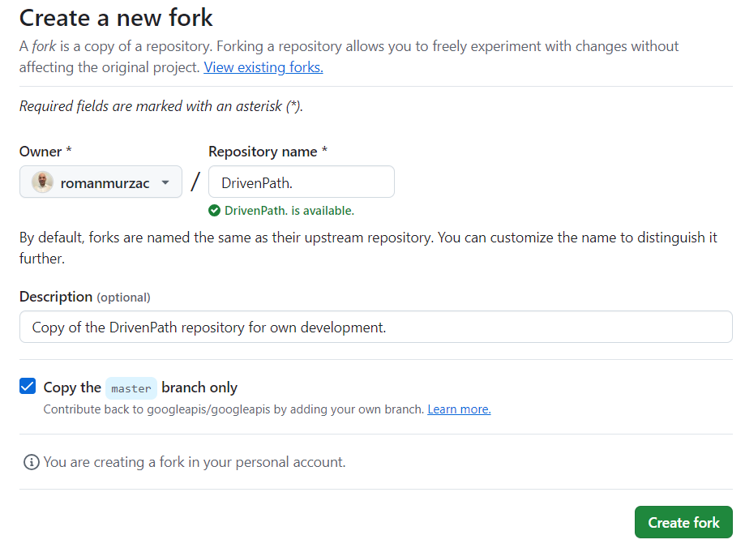
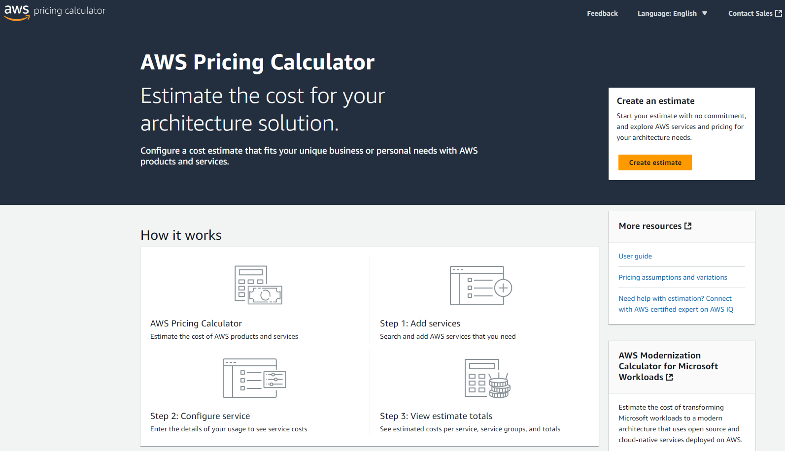
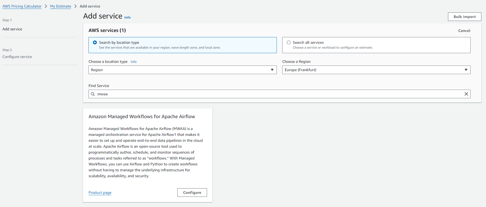
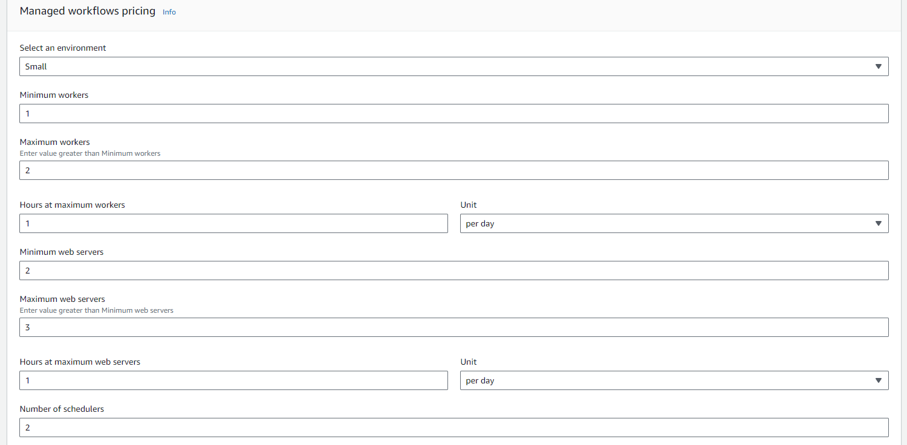
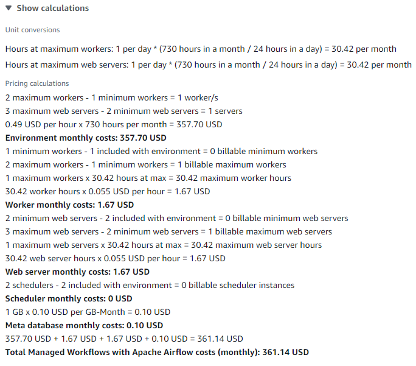

# Data Engineering Introduction

## Description
**Data Engineering Introduction** is a repository designed to guide junior engineers and professionals transitioning into Data Engineering. This program combines theoretical learning with hands-on practice, enabling anyone to build, deploy, and manage data pipelines, culminating in a comprehensive project applicable to real-world scenarios.

Through a scenario-driven approach, users will gain technical skills and understand how to apply them practically. By the end of the program, users will have constructed a complete data pipeline for a simulated small business, setting them on the path to becoming proficient Data Engineers.
## Content
- [Description](#description)
- [Repository Structure](#repository-structure)
- [Getting Started](#getting-started)
- [Cloud Usage](#cloud-usage)
- [Contributing](#contributing)
- [License](#license)
- [Contact](#contact)

## Repository Structure
DrivenPath is organized into **chapters**.\
To follow a structured path from foundational skills to more advanced ones, it’s recommended to complete each chapter in the given order. This will help prepare for certifications or entry-level Big Data Engineer roles. Alternatively, if you need to refresh specific topics, feel free to jump directly to the relevant chapter.

### Chapter Structure
Each chapter focuses on a single topic, featuring both theoretical and practical components.
```
chapter_n
├───src_n
|   |───example.py
|   └───sample.sql
├───work_n
|   └───scenario_n.md
└───README.md
```

Each chapter has two primary directories: `src_n` and `work_n`. The `src_n` directory contains code and data generated by the authors for **DrivenPath**, which can be used for replication and reference. The `work_n` directory contains a single file, `scenario_n.md`, where the chapter’s scenario and tasks for the **LeadData** project are provided for your implementation.

### Chapter Descriptions
The repository is built around a real-world scenario. Each chapter introduces a specific scenario element and provides theoretical knowledge, followed by practical exercises to implement that part. 

#### [Chapter 1: Introduction to Data Engineering](chapter_1)
Introduces fundamental Data Engineering concepts. Theoretical knowledge covers core concepts, while practical work includes account setup and software installation.

#### [Chapter 2: Batch processing - Local Development](chapter_2)
Covers Extract, Transform, Load (ETL) processes, normalization, denormalization, and related technologies. Users will extract, transform, and load data as part of the practical exercise.

#### [Chapter 3: Batch processing - Local Pipeline](chapter_3)
Focuses on Docker and Airflow concepts. Practical work involves containerizing Airflow, a database, and dbt.

#### [Chapter 4: Batch processing - Cloud: Console Pipeline](chapter_4)
Introduces AWS services. Users set up services and configure Airflow within the AWS environment.

#### [Chapter 5: Batch processing - Cloud: Automated Pipeline](chapter_5)
Discusses IAM and Terraform concepts. Users create IAM roles, develop and test Terraform, and automate pipeline deployment.

#### [Chapter 6: Batch processing - CI/CD Pipeline](chapter_6)
Explores Continuous Integration and Continuous Deployment (CI/CD) with GitHub Actions. Practical work includes implementing CI/CD for data workflows.

#### [Chapter 7: Streaming processing - Local Pipeline](chapter_7)
Covers Kafka, producer/consumer roles, and topics. Practical work includes containerizing Kafka, creating custom producers and consumers, and ingesting data into a local database in real time.

#### [Chapter 8: Streaming processing - Cloud Pipeline](chapter_8)
Introduces Lambda functions, Simple Queue Service, and JSON real-time data handling.

#### [Chapter 9: Distributed Computing](chapter_9)
Explores Apache Spark and PySpark for distributed computing. Practical work includes local development with Google Colab and cloud deployment with AWS Glue.

#### [Chapter 10: Analytics and Visualisation](chapter_10)
Covers analytics and dashboard creation with Python Dash. Users learn to deploy dashboards using AWS Elastic Container Registry and Cloud App Runner.

## Getting Started
1. Login in to GitHub.\
Go to [GitHub](https://github.com/) and `Sign in` with your credentials or create new account using `Sign up` if you don't have one.

2. Navigate to DrivenPath.\
Go to the [DrivenPath](https://github.com/romanmurzac/DrivenPath) repository.

3. Fork the DrivenPath Repository.\
In the DrivenPath repository, click on `Fork` to create a personal copy.\


4. Complete the Fork.\
Confirm the fork to establish your own copy of the repository, providing you with a personal workspace to follow the learning process.\


5. Clone DrivenPath Locally.\
Open a terminal, navigate to your preferred directory, and clone your repository by replacing `repository-path` with the path where you’d like to store it, and `your-username` with your GitHub username.
```
cd <repository-path>
git clone https://github.com/<your-username>/DrivenPath.git
```

6. Create a Branch.\
It’s recommended to create a separate branch for each chapter. Replace `no` with the chapter number.
```
git checkout -b chapter_<no>
```

7. Commit and Push Changes.\
After each work session, commit your changes and push them to your branch.
```
git add .
git commit -m "Chapter <no>: Message with esential changes."
git push
```

## Cloud Usage
The cloud is a powerful resource for developing and deploying products, but it's important to remember that it comes with costs. Careful planning and management of services can help avoid unexpected expenses.\
To forecast your expenses for the services you plan to use, access the [AWS Pricing Calculator](https://calculator.aws/#/). Click on **Create Estimate** to begin your calculations.


1. **Select Your Region**: In the **Search by location type** dropdown, choose the region where you intend to deploy your services. This will ensure that pricing reflects the correct geographic area.

2. **Add Services**: Search for the specific AWS services you wish to include in your estimate. After locating a service, click **Configure** to proceed to the configuration options.\


3. **Configure Your Services**: Enter details that closely match your expected usage scenarios. Fill out the configuration fields for each service to customize your estimate based on your needs.


4. **Review Calculations**: Once you’ve configured your services, you can view detailed calculations for each component, as well as the total estimated monthly bill.


By following these steps, you can effectively manage your cloud expenses.

## Contributing
Contributions are welcome! If you find issues or have ideas for improvements, feel free to fork or clone the repository and submit a pull request.

## License
This project is licensed under the MIT License. See the [LICENSE](LICENSE) file for details.

## Contact
If you have questions or need support, please open an issue in the repository or reach out via [LinkedIn](https://www.linkedin.com/in/roman-murzac/).