# **Chapter 1:** Introduction to Data Engineering 

## Scenario
You have been hired as a **Junior Data Engineer** at **DrivenData**.\
**DrivenData** is a start-up that entered the market one year ago, providing fiber-optic internet to its customers. Initially, they had around 100 clients, but their customer base has been expanding rapidly. Currently, they add approximately 10,000 new clients each month, and the company projects they will reach around 50,000 clients per month by the end of the year.

The company operates in two-week sprints, uses *Git* for version control, and relies on *GitHub* for collaborative coding and storage across departments. *Amazon Web Services (AWS)* is their cloud provider, where all services are deployed to support the business operations.

## Assignment
For this Sprint / Chapter your tasks include:
1. **Read** the following topics in the [Theory](#theory) section:\
    a. Big Data.\
    b. Data Engineer.\
    c. Cloud Computing.\
    d. AWS.

2. **Implement** the steps in the [Practice](#practice) section for *DataDriven* company:\
    a. Create Account:
    * i. AWS.
    * ii. GitHub.

    b. Install:
    * i. Python.
    * ii. VS Code.
    * iii. Docker Desktop.
    * iV. pgAdmin4.
    * v. AWS CLI.
    * vi. Terraform.

3. **Complete** tasks for *LeadData* company:
    * Review the *Scenario* section, complete the stages in the *Assignment*, and document your work in `work_1/scenario_1.md`. Store all evidence of your work in the `work_1` directory.


## Theory
The main theoretical notions for the chapter along with resources for self-paced learning.

### Big Data
#### Description
Big data refers to extremely large and diverse collections of structured, unstructured, and semi-structured data that continues to grow exponentially over time. These datasets are so huge and complex in volume, velocity, and variety, that traditional data management systems cannot store, process, and analyze them.
#### References
[Google Cloud Platform - What is Big Data?](https://cloud.google.com/learn/what-is-big-data?hl=en)\
[Oracle - What Is Big Data?](https://www.oracle.com/uk/big-data/what-is-big-data/)\
[TechTarget - What is big data?](https://www.techtarget.com/searchdatamanagement/definition/big-data)

### Data Engineer
#### Description
A data engineer integrates, transforms, and consolidates data from various structured and unstructured data systems into structures that are suitable for building analytics solutions. The data engineer also helps design and support data pipelines and data stores that are high-performing, efficient, organized, and reliable, given a specific set of business requirements and constraints.
#### References
[MongoDB - Data Engineering Explained](https://www.mongodb.com/resources/basics/data-engineering#:~:text=Data%20engineering%20is%20the%20discipline,draw%20valuable%20insights%20from%20it.)\
[dremio - Introduction to Data Engineering](https://www.dremio.com/resources/guides/intro-data-engineering/)\
[Redpanda - Data engineering 101](https://www.redpanda.com/guides/fundamentals-of-data-engineering)

### Cloud Computing
#### Description
Cloud computing and associated solutions provide access through the web to computing resources and products, including development tools, business applications, compute services, data storage, and networking solutions. These cloud services are hosted at a software vendor’s data center and managed by the cloud services provider or onsite at a customer's data center.
#### References
[IBM - What is cloud computing?](https://www.ibm.com/topics/cloud-computing)\
[SalesForce - What Is Cloud Computing?](https://www.salesforce.com/ca/cloud-computing/)\
[Oracle - What is cloud computing?](https://www.oracle.com/uk/cloud/what-is-cloud-computing/)

### AWS
#### Description
Amazon Web Service, or AWS, is an online platform providing cost-effective, scalable cloud computing solutions. It offers a range of on-demand operations, such as compute power, content delivery, database storage, and more, to help enterprises and organizations grow
#### References
[AWS - Documentation](https://docs.aws.amazon.com/?nc2=h_ql_doc_do)\
[Simplilearn - What is AWS: An Ultimate Guide to Amazon Web Services](https://www.simplilearn.com/tutorials/aws-tutorial/what-is-aws)\
[AWS - Cloud computing with AWS](https://aws.amazon.com/what-is-aws/)

## Practice
The implementation for the practical part for the chapter.

### Create Accounts
Set up accounts for the services commonly used by a data engineer.

#### AWS
Access [AWS Free Tier](https://aws.amazon.com/free/?gclid=Cj0KCQjwlvW2BhDyARIsADnIe-IgwrWgVraM9DbxPuBhtXrzhDOv1RoLsFkd13_kZDe0KCPqFPb3rjAaAiKSEALw_wcB&trk=9ab5159b-247d-4917-a0ec-ec01d1af6bf9&sc_channel=ps&ef_id=Cj0KCQjwlvW2BhDyARIsADnIe-IgwrWgVraM9DbxPuBhtXrzhDOv1RoLsFkd13_kZDe0KCPqFPb3rjAaAiKSEALw_wcB:G:s&s_kwcid=AL!4422!3!645133561110!e!!g!!create%20aws%20account!19579657595!152087369744&all-free-tier.sort-by=item.additionalFields.SortRank&all-free-tier.sort-order=asc&awsf.Free%20Tier%20Types=*all&awsf.Free%20Tier%20Categories=*all) page and press `Create a Free Account` button in center of the page.\
If you already have an account just press `Sign in to an existing AWS account`.\
You can follow instructions below or access [Create Your AWS Account](https://aws.amazon.com/getting-started/guides/setup-environment/module-one/) and follow instruction from there.\
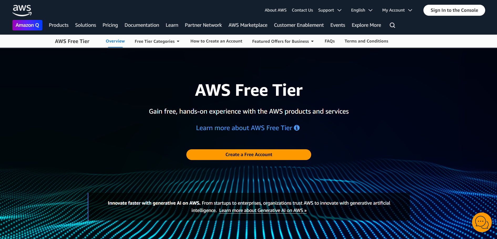

**Step 1 - Select credentials**\
1 - Enter an email address and an account name.\
Carefully consider which email address you want to use. If you are setting up for a personal account, we don't recommend using a work email address because you may change jobs at some point. Conversely, for business accounts, we recommend using an email alias that can be managed because the person setting up the account may, at some point, change roles or companies.\
2 - Select Verify email address.\
You will get a verification code in your email. Enter the verification code and choose Verify.
You will be redirected to a new screen where you will create your root user password.\
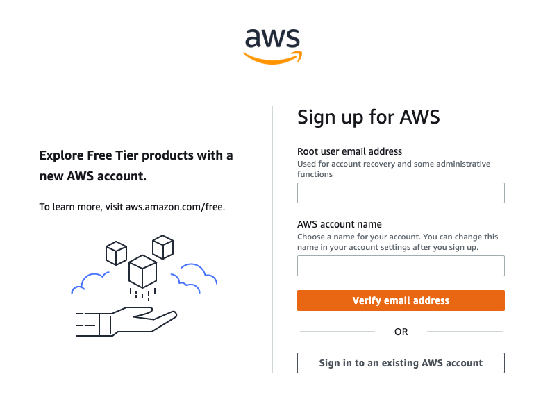

**Step 2 - Add contact information**\
1 - Choose between a business or personal account.\
There is no difference in account type or functionality, but there is a difference in the type of information required to open the account for billing purposes.
For a business account, choose a phone number that is tied to the business and can be reached if the person setting up the account is not available.\
2 - Once you have selected the account type, fill out the contact information about the account.
Save these details in a safe place. If you ever lose access to the email or your two-factor authentication device, AWS Support can use these details to confirm your identity.\
3 - At the end of this form, please read through the terms of the AWS Customer Agreement and select the checkbox to accept them.\
4 - Choose Continue (step 2 of 5) to proceed to the next screen.\
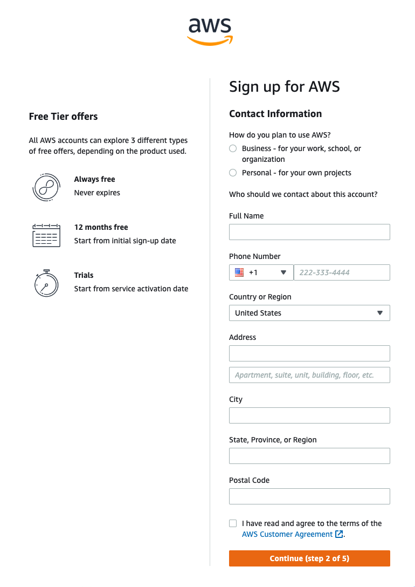

**Step 3 - Add a payment method**\
1 - Enter your Billing Information details.\
A small hold will be placed on the card, so the address must match what your financial institution has on file for you or your business.\
2 - Select Verify and Continue (step 3 of 5) to proceed.\


**Step 4 - Confirm your identity**\
1 - Choose how you want to confirm your identity.\ 
You can verify your account either through a text message (SMS) or a voice call on the number you are associating with this account.
For the text message (SMS) option, you will be sent a numeric code to enter on the next screen after you choose Send SMS. 
For the Voice call option, you will be shown a code on the screen to enter after being prompted by the automated voice verification system.\
2 - Enter the code as appropriate for your verification choice, then choose Continue to proceed to the final step.\
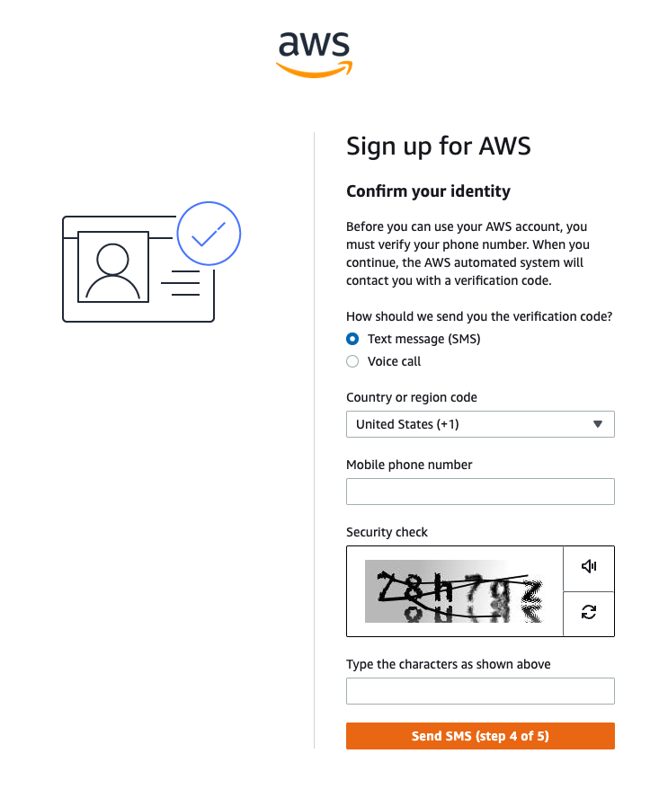

**Step 5 - Select a support plan**\
1 - Choose a support plan. For this tutorial, we recommend the default selection.\
You have three options for support plans. The default option is called Basic Support and is free of charge. If you are not sure, select Basic Support. You can always change support tiers at a later date. 
To see the full list of differences between the tiers, see Compare AWS Support Plans.\
2 - To finish creating your account, choose Complete sign up.\
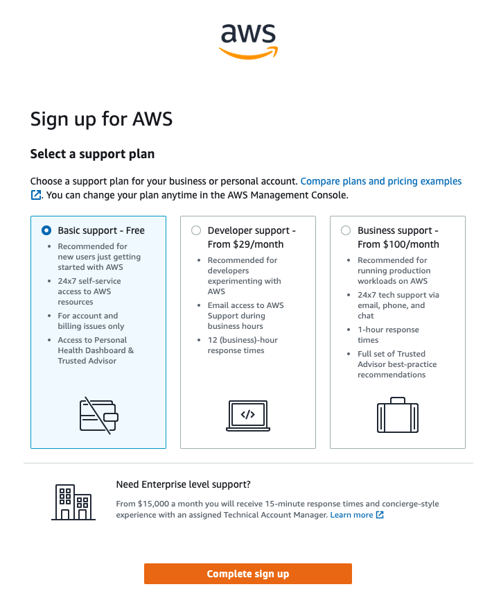

Your account is now set up and being activated. When activation is complete, you will receive an email from AWS. Use the credentials you created in this module to log in to your root account.

#### GitHub
Access [GitHub](https://github.com/) page and press `Sign up` button in right corner of the page.\
If you already have an account just press `Sign  in` and login using existing credentials.\
You can follow instructions below or access [Creating an account on GitHub](https://docs.github.com/en/get-started/start-your-journey/creating-an-account-on-github) and follow instruction from there.\


**Step 1 - Select credentials**\
Provide an email address that is not use for another GitHub account.\
Create a strong password that contains minimum 8 characters and strong enough to pass the verification from GitHub.\
Provide a username for your account.\
Choose the option for receive announcements from GitHub.\


**Step 2 - Pass verification**\
Solve three puzzles in order to check that you're a human.
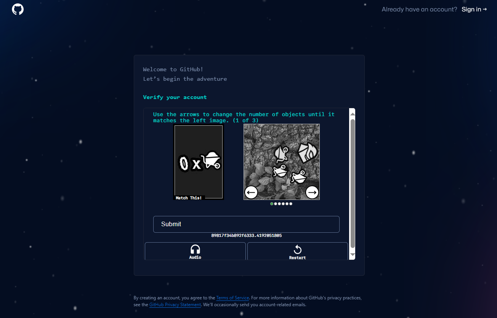

**Step 3 - Confirm email address**\
We'll receive an 8-digit code from GitHub on your email address that you used for account setup. Copy the code in current page.
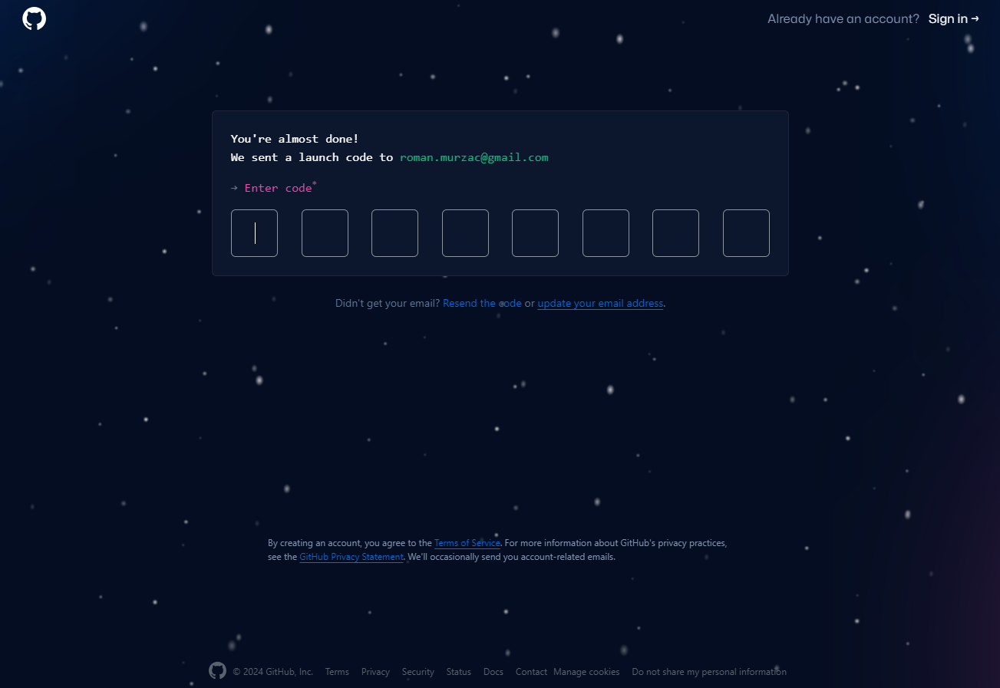

**Step 4 - Choose you plan**\
Choose the plan for your account. For your personal use the free account is always enough. Press `Continue for free`.
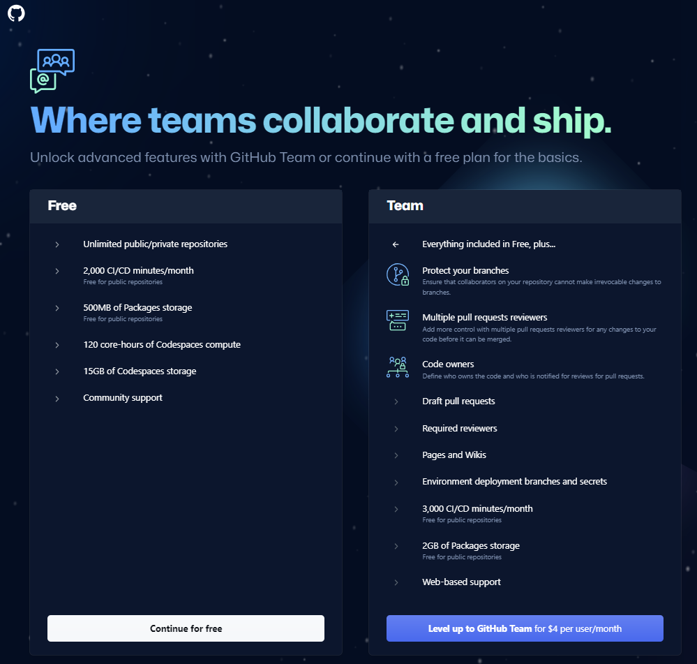

### Install software
Install necessary software used in daily work of a Data Engineer.

#### Python
Access [Python site](https://www.python.org/downloads/) page and press `Download Python 3.<version>` button in center of the page.\
You can follow instructions below or access [How to Install Python on Your System: A Guide](https://realpython.com/installing-python/) and follow instruction from there.\
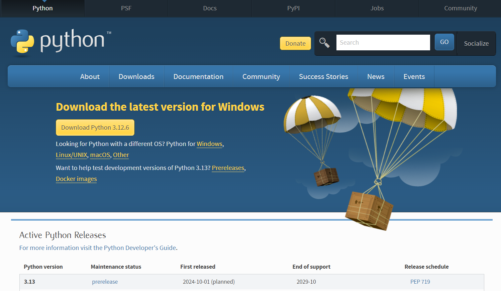

Pressing the button from above you'll download Python Installer on your local machine. Once you have it downloaded, navigate to your `Download` directory, identify Python Installer and double-click on it. The pop-up window will appear, from this window choose `Customize installation` and check both check boxes available: `Install launcher for all users` and `Add Python to PATH`.
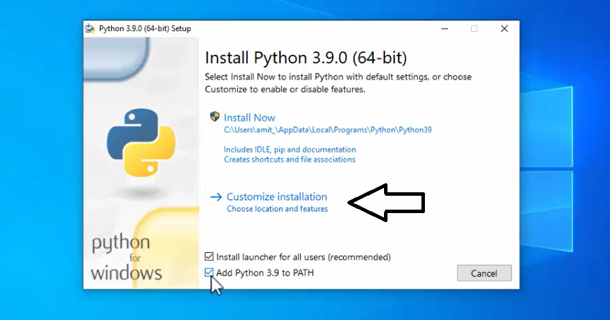

Also, a recommendation is to install all optional features.\
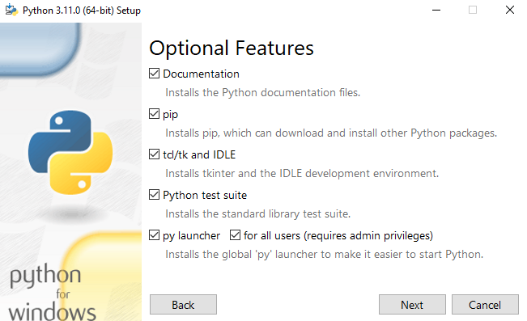

After installation check if Python was installed successfully on your machine by opening a terminal and writing command:
```
python --version
```
You should see as output version installed on your local machine.\
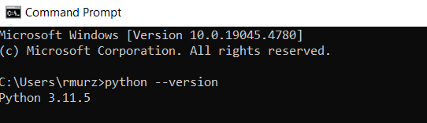

#### VS Code
Access [VS Code site](https://code.visualstudio.com/) page and press `Download for <OS>` button in center of the page.\
You can follow instructions below for installation on your machine or access [VS Code online](https://vscode.dev/) and work directly from there.
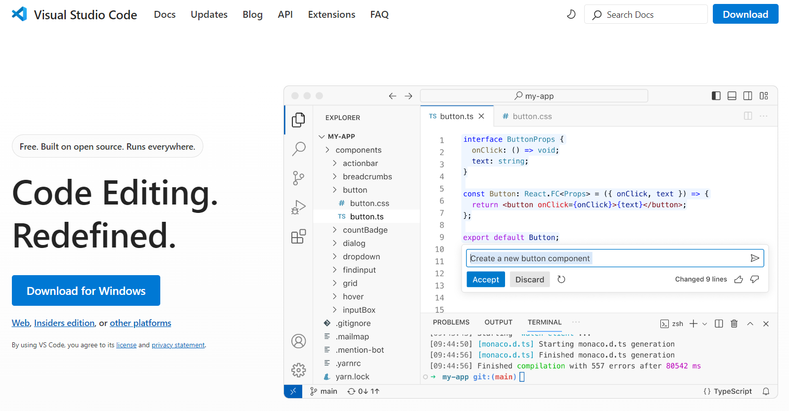

Pressing the button from above you'll download VS Code Installer on your local machine. Once you have it downloaded, navigate to your `Download` directory, identify VS Code Installer and double-click on it. The pop-up window will appear, from this window select all available options or choose those that you need.\


Once installation process is completed, press `Finish` button and launch the VS Code editor.\
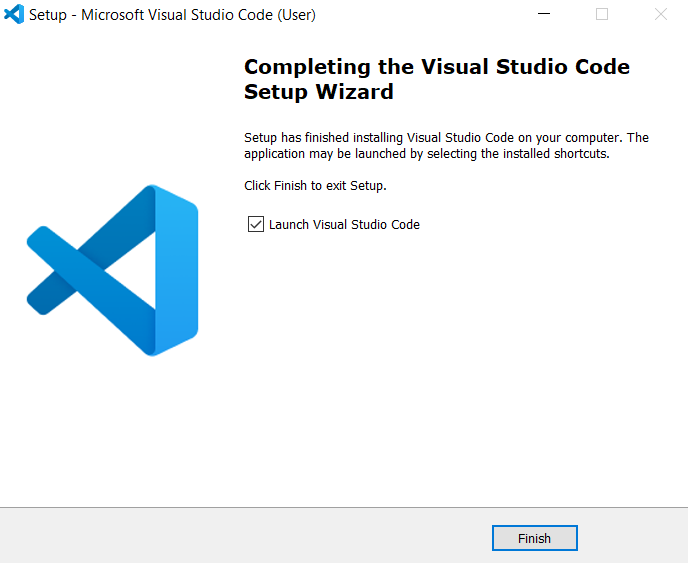

#### Docker
Access [Docker site](https://www.docker.com/products/docker-desktop/) page and press `Download for <OS>` button in center of the page.\
You can follow instructions below or access [Install Docker Desktop](https://docs.docker.com/desktop/install/windows-install/) and follow instruction from there.\
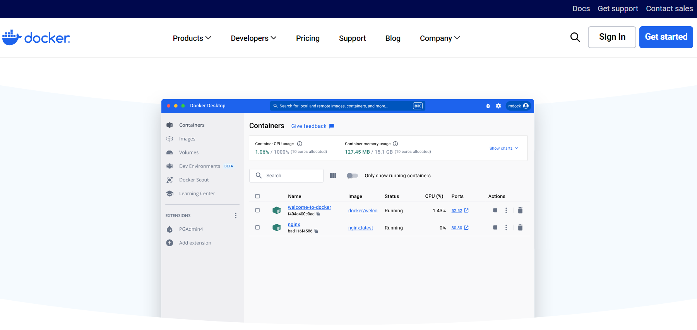

Double-click `Docker Desktop Installer.exe` to run the installer. By default, Docker Desktop is installed at `C:\Program Files\Docker\Docker`.\
When prompted, ensure the Use WSL 2 instead of Hyper-V option on the Configuration page is selected or not depending on your choice of backend.\
If your system only supports one of the two options, you won't be able to select which backend to use.\
Follow the instructions on the installation wizard to authorize the installer and proceed with the installation.\


When the installation is successful, select `Close` to complete the installation process.\
Start Docker Desktop.

As an alternative you can use [Docker Hub](https://www.docker.com/products/docker-hub/) and store your images on Docker Hub. Click on `Create Hub Account` and follow the instructions provided or press `Explore Docker Hub` if already have an account.
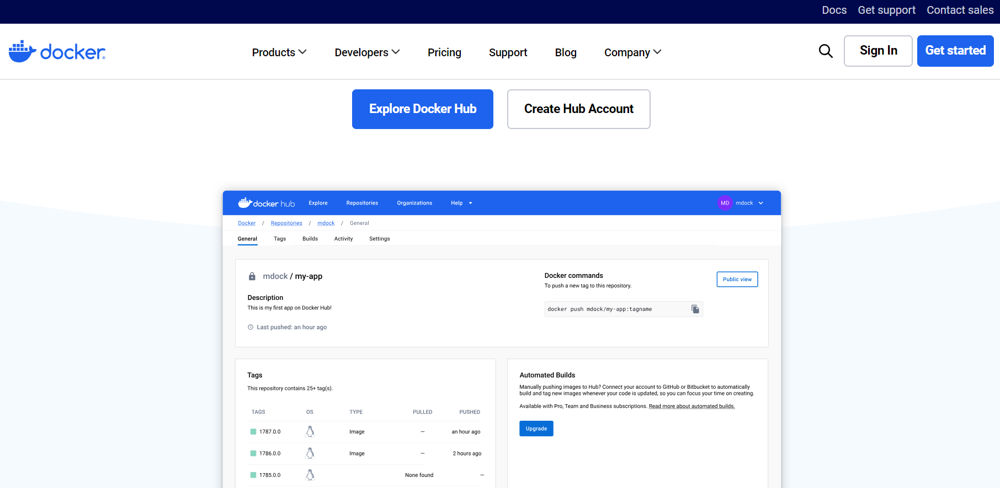

#### pgAdmin 4
In order to be able to work with databases locally and use software for database management it is required to have a database system as PostgreSQL and for management pgAdmin4.\
Access [PostgreSQL](https://www.postgresql.org/download/) page and downloaded latest version for your OS. Once downloaded, run the installer and follow the on-screen instructions to install pgAdmin on your machine.\
Access [pgAdmin 4](https://www.pgadmin.org/download/pgadmin-4-windows/) page and downloaded latest version for your OS. Once downloaded, run the installer and follow the on-screen instructions to install pgAdmin on your machine.\


#### AWS CLI
Access [AWS CLI installer](https://awscli.amazonaws.com/AWSCLIV2.msi) page, and it will be downloaded automatically to your machine.\
You can follow instructions below or access [Install or update to the latest version of the AWS CLI](https://docs.aws.amazon.com/cli/latest/userguide/getting-started-install.html) and follow instruction from there.\

To update your current installation of AWS CLI on Windows, download a new installer each time you update to overwrite previous versions. AWS CLI is updated regularly.\
Download and run the [AWS CLI MSI installer for Windows (64-bit)](https://awscli.amazonaws.com/AWSCLIV2.msi). Alternatively, you can run the msiexec command to run the MSI installer.
```
C:\> msiexec.exe /i https://awscli.amazonaws.com/AWSCLIV2.msi
```
For various parameters that can be used with msiexec, see msiexec on the [Microsoft Docs website](https://learn.microsoft.com/en-us/windows-server/administration/windows-commands/msiexec). For example, you can use the `/qn` flag for a silent installation.
```
C:\> msiexec.exe /i https://awscli.amazonaws.com/AWSCLIV2.msi /qn
```
To confirm the installation, open the `Start` menu, search for cmd to open a command prompt window, and at the command prompt use the `aws --version` command.
```
C:\> aws --version
aws-cli/2.17.20 Python/3.11.6 Windows/10 exe/AMD64 prompt/off
```
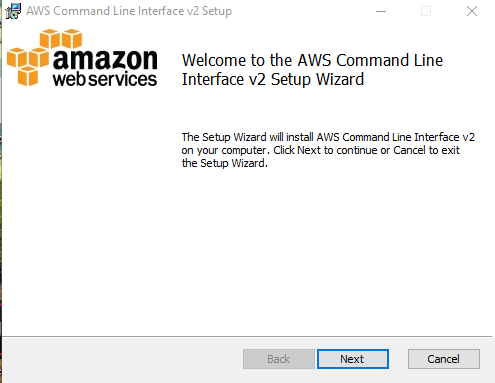

#### Terraform
Access [Terraform site](https://www.terraform.io/downloads.html) page and press `Download Terraform` button in center of the page.\
You can follow instructions below or access [Download & Install Terraform](https://spacelift.io/blog/how-to-install-terraform) and follow instruction from there.


 It will download a zip file. Create a folder on the C drive as `C:/terraform`. Download the zip file in this folder. Unzip the file to extract the `.exe` file.\
 Open the `Start` menu and search for `Environment variables`. Open the Environment variables `settings` page.
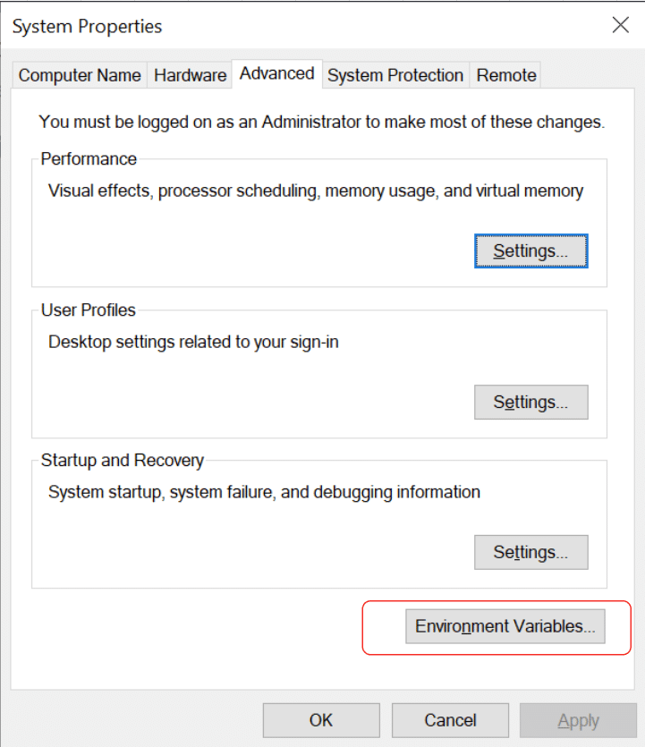

On the Environment variables edit page, open the Path variable.\
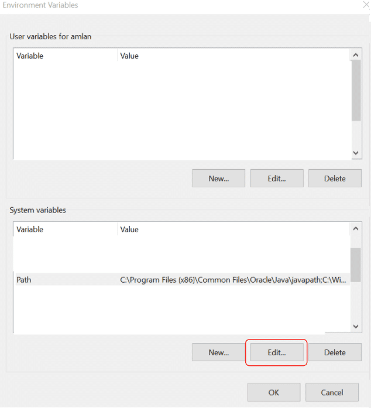

On the opened Path pop up, click New and add the Terraform download folder. This is the folder where the zip file was downloaded and unzipped (`C:/terraform`).\
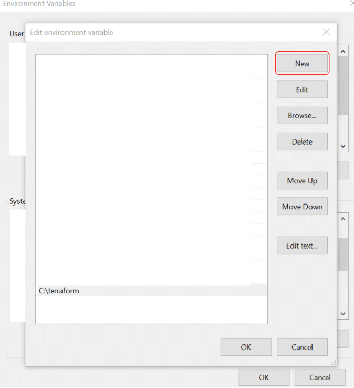

Click OK on the above window to save the Path variable addition. If needed, restart your system to apply the variable changes.\
Open a Command prompt and run this command to verify Terraform is installed successfully.
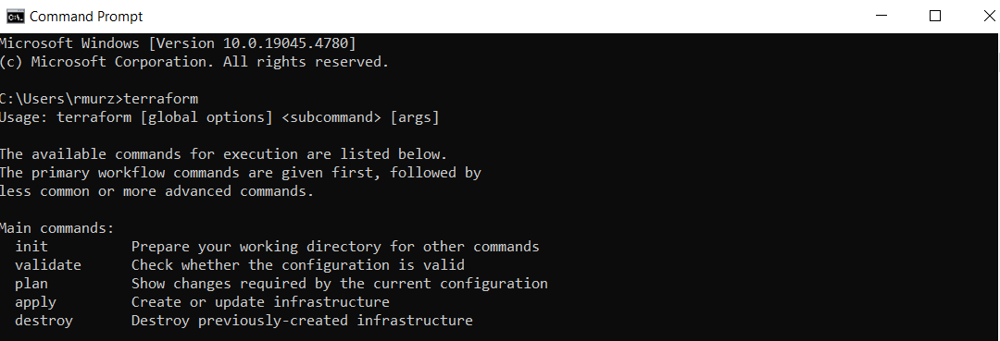