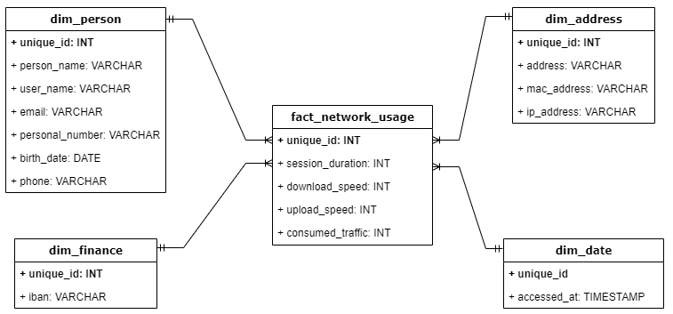

`Work in progress...`

# Chapter 2

## Scenario
For second Chapter / Sprint needs to investigate the data source for *DrivenData*, understand the amount of data from previous year, identify available fields and data types. Prepare local ETL pipeline to extract data into bronze layer (raw zone), apply necessary transformations into silver layer (staging zone), and upload data to the golden layer (trusted zone) for consumtion in analytical process. 

## Assignment
For current Sprint / Chapter your tasks are:
1. **Read** from [Theory](#theory) section about:\
    a. Batch processing.\
    b. Extract data.\
    c. Data normalization.\
    d. Python.\
    e. SQL.\
    f. Framework.
2. **Implement** from [Practice](#practice) section for *LeadData* company:\
    a. Investigate data source.\
    b. Extract data.\
    c. Transform data.\
    d. Load data.
3. **Work** for *DataDriven* company on Sprint / Chapter tasks:\
**Note:** For point 3 (*Work*) implementation, read current part for chosen scenario from `scenarios` directory and put all your work evidences in `work_2` directory.

## Theory
Main theoretical notions of the chapter with proper resources for self paced learning.

### ETL
#### Description
ETL meaning extract, transform, load; is a data integration process that combines, cleans and organizes data from multiple sources into a single, consistent data set for storage in a data warehouse, data lake or other target system.
#### References
[IBM - What is ETL?](https://www.ibm.com/topics/etl)\
[GeeksforGeeks - ETL Process in Data Warehouse](https://www.geeksforgeeks.org/etl-process-in-data-warehouse/)\
[AWS - What is ETL?](https://aws.amazon.com/what-is/etl/)

### Batch processing
#### Description
Batch processing is a computational technique in which a collection of data is amassed and then processed in a single operation, often without the need for real-time interaction. This approach is particularly effective for handling large volumes of data, where tasks can be executed as a group during off-peak hours to optimize system resources and throughput.
#### References
[Splunk - An Introduction to Batch Processing](https://www.splunk.com/en_us/blog/learn/batch-processing.html)\
[AWS - What is Batch Processing?](https://aws.amazon.com/what-is/batch-processing/)\
[Influxdata - Batch Processing Explained](https://www.influxdata.com/glossary/batch-processing-explained/)

### Extract data
#### Description
Data extraction is the process of obtaining raw data from a source and replicating that data somewhere else. The raw data can come from various sources, such as a database, Excel spreadsheet, an SaaS platform, web scraping, or others. It can then be replicated to a destination, such as a data warehouse, designed to support online analytical processing (OLAP). This can include unstructured data, disparate types of data, or simply data that is poorly organized. Once the data has been consolidated, processed, and refined, it can be stored in a central location — on-site, in cloud storage, or a hybrid of both — to await transformation or further processing.
#### References
[Stitch - What is Data Extraction? Data Extraction Tools & Techniques](https://www.stitchdata.com/resources/what-is-data-extraction/)\
[Zapier - What is data extraction? And how to automate the process](https://zapier.com/blog/data-extraction/?msockid=19299d3c1eef6bd012a689b41f156a45)\
[KnowledgeHut - What is Data Extraction? Examples, Tools & Techniques](https://www.knowledgehut.com/blog/data-science/data-extraction)

### Data normalization
#### Description
Data normalization is the process of structuring information in a database to cut down on redundancy and make that database more efficient. Think of normalization as a way to make sure that every field and table in your database is organized logically, so that you can avoid data anomalies when inserting, updating, or deleting records. This process is carried out according to specific rules that dictate how tables should be organized.
#### References
[Splunk - Data & Database Normalization Explained: How To Normalize Data](https://www.splunk.com/en_us/blog/learn/data-normalization.html)\
[Database Star - Database Normalization: A Step-By-Step-Guide With Examples](https://www.databasestar.com/database-normalization/)\
[Metabase - Data normalization](https://www.metabase.com/learn/grow-your-data-skills/data-fundamentals/normalization)

### Python
#### Description
Python is a high-level, general-purpose programming language. Its design philosophy emphasizes code readability with the use of significant indentation. Python is dynamically typed and garbage-collected. It supports multiple programming paradigms, including structured (particularly procedural), object-oriented and functional programming. It is often described as a "batteries included" language due to its comprehensive standard library.
#### References
[Python documentation](https://docs.python.org/3/)\
[W3School - Python Tutorial](https://www.w3schools.com/python/)\
[Real Python Tutorials](https://realpython.com/)

### SQL
#### Description
SQL is a standard database language used to access and manipulate data in databases. SQL stands for Structured Query Language. It was developed by IBM Computer Scientists in the 1970s. By executing queries SQL can create, update, delete, and retrieve data in databases like MySQL, Oracle, PostgreSQL, etc. Overall, SQL is a query language that communicates with databases.
#### References
[SQL Tutorial](https://www.sqltutorial.org/)\
[W3School - Introduction to SQL](https://www.w3schools.com/sql/sql_intro.asp)\
[GeeksforGeeks - SQL Tutorial](https://www.geeksforgeeks.org/sql-tutorial/)

### Framework
#### Description
Whenever you work with any programming language, you might hear about various frameworks based on that language. When you work on software, you might use any framework to enhance the quality of your application. Frameworks provide many advantages to the developers and reduce the time and effort required in the development process. They enable developers to write clean code that is easily understandable by others.
#### References
[Medium - How you can master a new data engineering framework?](https://medium.com/@sounder.rahul/how-you-can-master-a-new-data-engineering-framework-e3a7c31458e5)\
[Medium - Top 6 data engineering frameworks to learn](https://blog.insightdatascience.com/top-6-data-engineering-frameworks-to-learn-b124f9b71ba5)\
[GeeksforGeeks - What is a Framework?](https://www.knowledgehut.com/blog/data-science/data-extraction)

## Practice
Implemention for the practical part of the chapter.

### Investigate the data source
Investigate data that are generated based on each user login to the internet platform of the *DataDriven* company and understand what is amount of existing data at this moment, what columns are available and what type of data they contains.\
After the investigation prepare to create the local ETL in order to create the pipeline.\
Data contains 16 columns: person_name, user_name, email, personal_number, birth_date, address, phone, mac_address, ip_address, iban, accessed_at,
session_duration, download_speed, upload_speed, consumed_traffic, unique_id.\
The number of records at this moment is: 100.372 records and expected daily rate of the records is up to 1.000 records.\
At this stage the company want to ingest all historical data and daily ingest data from previous day for analytical processes.

### Extract data
Data can be obtained through a few options: API, Scrapping, Crawling, Generator, Manual, etc.\
For *DataDriven* it will be used a synthetic data generator that will mimic an API data generator.\
As the data from the previous year are not big (~30 MB) it is not required an application for intesive processing, also the API from a real application will be replaced by a synthetic data generator. At this stage will be used Python for programming part, [Faker](https://faker.readthedocs.io/en/master/) library for synthetic data generation, and [Polars](https://docs.pola.rs/) library for data handling.

#### Data generator
To ingest historical data need to create a Framework (just a script a this moment; it will inscrease in complexity during next Chapters / Sprints).

Create a file in `src_2` directory and name it `batch_generator.py`, create a subdirectory named `data_2`.

In `batch_generator.py` file import all necessary packages and modules. Also, define what logging level and messages to be stored.

Create function `create_data` that will instantiate data generator with provided language engine, for *DataDriven* is used Romanian engine, this means that all synthetic data will romanian.

Create function `generate_record` and provide synthetic function to obtain all necessary fields. This function will generate one records per call, the records will contain all defined fields. All used functions are commented in code.

Due to the amount of data and number of columns, generated data will be written to a CSV file. For this, create function `write_to_csv`. In this function will specified how many records to be generated.

Each records should be uniquely identified, for this will be added a new column named `unique_id` that will contain [UUID](https://medium.com/@gaspm/understanding-uuid-purpose-and-benefits-of-a-universal-unique-identifier-59110154d897) value. Polars will be used for this activity.

For historical data the `accessed_at` column contains datetime from previous year. For next load this column should contain only the datetime from previous day. For this action will be created function `update_datetime` that will handle this need for all *next* run.

As the `batch_generator.py` will be part of the Framework, for now it will be used as a script, but in future Chapters / Sprints it will be used as a module in Framework. Because of this, it will be run as a script by adding the Framework logic under the line `if __name__ == "__main__":`.\
Start logging process, define the path for generated CSV file, define the date for initial load and next loads. For loads define the number of records (from Scenario - initial = 100.372 and next = maximum 1.000), also define time of load based on date. Extract data to the CSV file, add the unique identifier, and update datetime if necessary. Finish loading process and log this.

Logging messages after initial run. For all *next* run there will an additional message that will log the fact that the datetime was updated.

#### Data extraction
Once data generation is done in `data_2` directory is available `batch_20024-09-14.csv` CSV file that contains all 16 columns and 100.372 rows. In this CSV file are contained source data (data that should be available via API). In this step the source data will be extracted to the bronze layer (raw zone) as it is and data will become raw data.

Open pgAdmin 4 and create a new Server. `Right-click` on server icon and choose `Register` -> `Server`.\

In opened dialog box in `General` section introduce *DataDriven* name for the server.

In `Connection` section introduce *localhost* as *Host name*, *postgres* as *Username* and a *password* for your server and press `Save`.

In new created server create a database by `Right-click` on *DataDriven* server, choose `Create` -> `Database`.\

In opened dialog box in *General* section introduce *datadriven_db* as *Databse* and press `Save`.

Now the database is available with a *public* schema and without tables.\

`Right-click` on *Tables* icon and choose `Create` -> `Table`.
In opened dialog box introduce the *batch_first_load* as *Name*.

In *Columns* section introduce all necessary columns one by one.\

Also, in *Columns* section for each introduced column define the data type for this column.\

Here is a sample how the columns and their data types should look like.

In *Tables* section now is present *batch_first_load* table.\

The table is created and the columns defined, but the table contains no data. In order to upload source data `Right-click` on table icon choose `Import/Export data` option and in *General* section select the CSV file to be loaded.

If you move to the *Columns* section there should be visible all available columns. If the columns are not available make sure that table' columns were defined correct. After all settings are done press `OK`.

If all previous steps were performed correct the result should show a pop-up window with *Process completed*. If here is a *Process failed* message update previous step by riding message from current window.

`Right-click` on the table icon and choose `Query tool` option. Use SQL query from `select_all_raw_data.sql` file to retrieve a sample of **raw data**.

Navigate to *Schemas* from the *datadriven_db* database and `Right-click` on it, choose `Create` -> `Schema` option, introduce *bronze_layer* as a *Name* and press `Save`. Reapeat this for *silver_layer* and *golden_layer* schemas. In *bronze_layer* repeat all operations for create *batch_first_load* table and load source data in order to obtain raw data in necessary schema - *bronze_layer*.\

### Transform data

Once the raw data are in bronze layer it be transformed and moved to the silver layer.

The main transformation from raw zone to staging zone will be to normalize the data.

Use `create_dim_address.sql` file to create *dim_address* table.
Use `create_dim_data.sql` file to create *dim_date* table.
Use `create_dim_finance.sql` file to create *dim_finance* table.
Use `create_dim_person.sql` file to create *dim_person* table.
Use `create_fact_network_usage.sql` file to create *fact_network_usage* table.

### Load data
