# **Chapter 2:** Batch processing - *Local Development*

## Scenario
For the second chapter/sprint, you need to investigate the data source for *DrivenData*, understand the amount of data from the previous year, and identify available fields and data types. Prepare a local ETL pipeline to extract data into the bronze layer (raw zone), apply necessary transformations into the silver layer (staging zone), and upload data to the golden layer (trusted zone) for consumption in the analytical process. It is required that the golden layer contains four tables: a financial table for payment calculations, a technical table for analyzing technical issues, a non-PII table for access by all users with limited access levels across the organization, and a PII table for users with high access levels.

## Assignment
For this Sprint / Chapter your tasks include:
1. **Read** the following topics in the [Theory](#theory) section:\
    a. Extract Transform Load.\
    b. Batch processing.\
    c. Extract data.\
    d. Data normalization.\
    e. Python.\
    f. SQL.\
    g. Framework.

2. **Implement** the steps in the [Practice](#practice) section for *DataDriven* company:\
    a. Investigate data source.\
    b. Extract data:
    * i. Data generator.
    * ii. Data extraction.

    c. Transform data:
    * i. Bronze layer.
    * ii. Silver layer.

    d. Load data:
    * i. Financial Data.
    * ii. Support Data.
    * iii. Non-PII Data.
    * iv. PII Data.

3. **Complete** tasks for *LeadData* company:
    * Review the *Scenario* section, complete the stages in the *Assignment*, and document your work in `work_2/scenario_2.md`. Store all evidence of your work in the `work_2` directory.

## Theory
The main theoretical notions for the chapter along with resources for self-paced learning.

### ETL
#### Description
ETL meaning extract, transform, load; is a data integration process that combines, cleans and organizes data from multiple sources into a single, consistent data set for storage in a data warehouse, data lake or other target system.
#### References
[IBM - What is ETL?](https://www.ibm.com/topics/etl)\
[GeeksforGeeks - ETL Process in Data Warehouse](https://www.geeksforgeeks.org/etl-process-in-data-warehouse/)\
[AWS - What is ETL?](https://aws.amazon.com/what-is/etl/)

### Batch processing
#### Description
Batch processing is a computational technique in which a collection of data is amassed and then processed in a single operation, often without the need for real-time interaction. This approach is particularly effective for handling large volumes of data, where tasks can be executed as a group during off-peak hours to optimize system resources and throughput.
#### References
[Splunk - An Introduction to Batch Processing](https://www.splunk.com/en_us/blog/learn/batch-processing.html)\
[AWS - What is Batch Processing?](https://aws.amazon.com/what-is/batch-processing/)\
[Influxdata - Batch Processing Explained](https://www.influxdata.com/glossary/batch-processing-explained/)

### Extract data
#### Description
Data extraction is the process of obtaining raw data from a source and replicating that data somewhere else. The raw data can come from various sources, such as a database, Excel spreadsheet, an SaaS platform, web scraping, or others. It can then be replicated to a destination, such as a data warehouse, designed to support online analytical processing (OLAP). This can include unstructured data, disparate types of data, or simply data that is poorly organized. Once the data has been consolidated, processed, and refined, it can be stored in a central location — on-site, in cloud storage, or a hybrid of both — to await transformation or further processing.
#### References
[Airbyte - What is Data Extraction? Data Extraction Tools and Techniques](https://airbyte.com/data-engineering-resources/data-extraction)\
[Stitch - What is Data Extraction? Data Extraction Tools & Techniques](https://www.stitchdata.com/resources/what-is-data-extraction/)\
[Zapier - What is data extraction? And how to automate the process](https://zapier.com/blog/data-extraction/?msockid=19299d3c1eef6bd012a689b41f156a45)

### Data normalization
#### Description
Data normalization is the process of structuring information in a database to cut down on redundancy and make that database more efficient. Think of normalization as a way to make sure that every field and table in your database is organized logically, so that you can avoid data anomalies when inserting, updating, or deleting records. This process is carried out according to specific rules that dictate how tables should be organized.
#### References
[Splunk - Data & Database Normalization Explained: How To Normalize Data](https://www.splunk.com/en_us/blog/learn/data-normalization.html)\
[Database Star - Database Normalization: A Step-By-Step-Guide With Examples](https://www.databasestar.com/database-normalization/)\
[Metabase - Data normalization](https://www.metabase.com/learn/grow-your-data-skills/data-fundamentals/normalization)

### Python
#### Description
Python is a high-level, general-purpose programming language. Its design philosophy emphasizes code readability with the use of significant indentation. Python is dynamically typed and garbage-collected. It supports multiple programming paradigms, including structured (particularly procedural), object-oriented and functional programming. It is often described as a "batteries included" language due to its comprehensive standard library.
#### References
[Python documentation](https://docs.python.org/3/)\
[W3School - Python Tutorial](https://www.w3schools.com/python/)\
[Real Python Tutorials](https://realpython.com/)

### SQL
#### Description
SQL is a standard database language used to access and manipulate data in databases. SQL stands for Structured Query Language. It was developed by IBM Computer Scientists in the 1970s. By executing queries SQL can create, update, delete, and retrieve data in databases like MySQL, Oracle, PostgreSQL, etc. Overall, SQL is a query language that communicates with databases.
#### References
[SQL Tutorial](https://www.sqltutorial.org/)\
[W3School - Introduction to SQL](https://www.w3schools.com/sql/sql_intro.asp)\
[GeeksforGeeks - SQL Tutorial](https://www.geeksforgeeks.org/sql-tutorial/)

### Framework
#### Description
Whenever you work with any programming language, you might hear about various frameworks based on that language. When you work on software, you might use any framework to enhance the quality of your application. Frameworks provide many advantages to the developers and reduce the time and effort required in the development process. They enable developers to write clean code that is easily understandable by others.
#### References
[Medium - How you can master a new data engineering framework?](https://medium.com/@sounder.rahul/how-you-can-master-a-new-data-engineering-framework-e3a7c31458e5)\
[Medium - Top 6 data engineering frameworks to learn](https://blog.insightdatascience.com/top-6-data-engineering-frameworks-to-learn-b124f9b71ba5)\
[GeeksforGeeks - What is a Framework?](https://www.geeksforgeeks.org/what-is-a-framework/)

## Practice
The implementation for the practical part for the chapter.

### Investigate the data source
Investigate data that are generated based on each user login to the internet platform of the *DataDriven* company and understand what is amount of existing data at this moment, what columns are available and what type of data it contains.\
After the investigation prepare to create the local ETL in order to create the pipeline.\
Data contains 16 columns: person_name, user_name, email, personal_number, birth_date, address, phone, mac_address, ip_address, iban, accessed_at,
session_duration, download_speed, upload_speed, consumed_traffic, unique_id.\
The number of records at this moment is: 100.372 records and expected daily rate of the records is up to 1.000 records.\
At this stage the company want to ingest all historical data and daily ingest data from previous day for analytical processes.

### Extract data
Data can be obtained through a few options: API, Scrapping, Crawling, Generator, Manual, etc.\
For *DataDriven* it will be used a synthetic data generator that will mimic an API data generator.\
As the data from the previous year are not big (~30 MB) it is not required an application for intensive processing, also the API from a real application will be replaced by a synthetic data generator. At this stage will be used Python for programming part, [Faker](https://faker.readthedocs.io/en/master/) library for synthetic data generation, and [Polars](https://docs.pola.rs/) library for data handling.

#### Data generator
To ingest historical data need to create a Framework (just a script at this moment; it will increase in complexity during next Chapters / Sprints).

Create a file in `work_2` directory and name it `batch_generator.py`, create a subdirectory named `data_2`. Replace `<path_to_drivenpath>` with your local path to the project location.
```
cd <path_to_drivenpath>\chapter_2\work_2
type nul > batch_generator.py
```

In `batch_generator.py` file import all necessary packages and modules. Also, define what logging level and messages to be stored.
```
import random
import csv
import logging
import uuid
import polars as pl

from faker import Faker
from datetime import date, datetime, timedelta

# Configure logging.
logging.basicConfig(
    level=logging.INFO,                    
    format='%(asctime)s - %(levelname)s - %(message)s',
    datefmt='%Y-%m-%d %H:%M:%S',
    handlers=[logging.StreamHandler()]
)
```

Create function `create_data` that will instantiate data generator with provided language engine, for *DataDriven* is used Romanian engine, this means that all synthetic data will romanian.
```
def create_data(locale: str) -> Faker:
    """
    Creates a Faker instance for generating localized fake data.
    Args:
        locale (str): The locale code for the desired fake data language/region.
    Returns:
        Faker: An instance of the Faker class configured with the specified locale.
    """
    # Log the action.
    logging.info(f"Created synthetic data for {locale.split('_')[-1]} country code.")
    return Faker(locale)
```

Create function `generate_record` and provide synthetic function to obtain all necessary fields. This function will generate one records per call, the records will contain all defined fields. All used functions are commented in code.
```
def generate_record(fake: Faker) -> list:
    """
    Generates a single fake user record.
    Args:
        fake (Faker): A Faker instance for generating random data.
    Returns:
        list: A list containing various fake user details such as name, username, email, etc.
    """
    # Generate random personal data.
    person_name = fake.name()
    user_name = person_name.replace(" ", "").lower()  # Create a lowercase username without spaces.
    email = f"{user_name}@{fake.free_email_domain()}"  # Combine the username with a random email domain.
    personal_number = fake.ssn()  # Generate a random social security number.
    birth_date = fake.date_of_birth()  # Generate a random birth date.
    address = fake.address().replace("\n", ", ")  # Replace newlines in the address with commas.
    phone_number = fake.phone_number()  # Generate a random phone number.
    mac_address = fake.mac_address()  # Generate a random MAC address.
    ip_address = fake.ipv4()  # Generate a random IPv4 address.
    iban = fake.iban()  # Generate a random IBAN.
    accessed_at = fake.date_time_between("-1y")  # Generate a random date within the last year.
    session_duration = random.randint(0, 36_000)  # Random session duration in seconds (up to 10 hours).
    download_speed = random.randint(0, 1_000)  # Random download speed in Mbps.
    upload_speed = random.randint(0, 800)  # Random upload speed in Mbps.
    consumed_traffic = random.randint(0, 2_000_000)  # Random consumed traffic in kB.

    # Return all the generated data as a list.
    return [
        person_name, user_name, email, personal_number, birth_date,
        address, phone_number, mac_address, ip_address, iban, accessed_at,
        session_duration, download_speed, upload_speed, consumed_traffic
    ]
```

Due to the amount of data and number of columns, generated data will be written to a CSV file. For this, create function `write_to_csv`. In this function will be specified how many records to be generated.
```
def write_to_csv(file_path: str, rows: int) -> None:
    """
    Generates multiple fake user records and writes them to a CSV file.
    Args:
        file_path (str): The path where the CSV file will be saved.
        rows (int): The number of fake user records to generate.
    """
    # Create a Faker instance with Romanian data.
    fake = create_data("ro_RO")
    
    # Define the CSV headers.
    headers = [
        "person_name", "user_name", "email", "personal_number", "birth_date", "address",
        "phone", "mac_address", "ip_address", "iban", "accessed_at",
        "session_duration", "download_speed", "upload_speed", "consumed_traffic"
    ]

    # Open the CSV file for writing.
    with open(file_path, mode="w", encoding="utf-8", newline="") as file:
        writer = csv.writer(file)
        writer.writerow(headers)
        
        # Generate and write each record to the CSV.
        for _ in range(rows):
            writer.writerow(generate_record(fake))
    # Log the action.
    logging.info(f"Written {rows} records to the CSV file.")

```

Each record should be uniquely identified, for this will be added a new column named `unique_id` that will contain [UUID](https://medium.com/@gaspm/understanding-uuid-purpose-and-benefits-of-a-universal-unique-identifier-59110154d897) value. Polars will be used for this activity.
```
def add_id(file_name) -> None:
    """
    Adds a unique UUID to each row in a CSV file.
    Args:
        file_name (str): The path to the CSV file to be processed.
    """
    # Load the CSV into a Polars DataFrame.
    df = pl.read_csv(file_name)
    # Generate a list of UUIDs (one for each row).
    uuid_list = [str(uuid.uuid4()) for _ in range(df.height)]
    # Add a new column with unique IDs.
    df = df.with_columns(pl.Series("unique_id", uuid_list))
    # Save the updated DataFrame back to a CSV.
    df.write_csv(file_name)
    # Log the action.
    logging.info("Added UUID to the dataset.")
```

For historical data the `accessed_at` column contains datetime from previous year. For next load this column should contain only the datetime from previous day. For this action will be created function `update_datetime` that will handle this need for all *next* run.
```
def update_datetime(file_name: str, run: str) -> None:
    """
    Update the 'accessed_at' column in a CSV file with the appropriate timestamp.
    Args:
        file_name (str): The path to the CSV file to be updated.
        run (str): Specifies the timestamp to be used.
    """
    if run == "next":
        # Get the current time without milliseconds and calculate yesterday's time.
        current_time = datetime.now().replace(microsecond=0)
        yesterday_time = str(current_time - timedelta(days=1))
        # Load the CSV into a Polars DataFrame.
        df = pl.read_csv(file_name)
        # Replace all values in the 'accessed_at' column with yesterday's timestamp.
        df = df.with_columns(pl.lit(yesterday_time).alias("accessed_at"))
        # Save the updated DataFrame back to a CSV file.
        df.write_csv(file_name)
        # Log the action.
        logging.info("Updated accessed timestamp.")
```

#### Data extraction
In this step the source data will be extracted to the bronze layer (raw zone) as it is and data will become raw data.

As the `batch_generator.py` will be part of the Framework, for now it will be used as a script, but in future Chapters / Sprints it will be used as a module in Framework. Because of this, it will be run as a script by adding the Framework logic under the line `if __name__ == "__main__":`.\
Start logging process, define the path for generated CSV file, define the date for initial load and next loads. For loads define the number of records (from Scenario - initial = 100.372 and next = maximum 1.000), also define time of load based on date. Extract data to the CSV file, add the unique identifier, and update datetime if necessary. Finish loading process and log this.
```
if __name__ == "__main__":

    # Logging starting of the process.
    logging.info(f"Started batch processing for {date.today()}.")

    # Define the output file name with today's date.
    output_file = f"chapter_2/work_2/data_2/batch_{date.today()}.csv"

    # Define number of records: first run - 10_372; next runs random number.
    if str(date.today()) == "2024-09-14":
        records = random.randint(100_372, 100_372)
        run_type = "first"
    else:
        records = random.randint(0, 1_101)
        run_type = "next"
    
    # Generate and write records to the CSV.
    write_to_csv(f"{output_file}", records)

    # Add UUID to dataset.
    add_id(output_file)

    # Update the timestamp.
    update_datetime(output_file, run_type)

    # Logging ending of the process.
    logging.info(f"Finished batch processing {date.today()}.")
```

Logging messages after *first* run. For all *next* run there will an additional message that will log the fact that the datetime was updated.

Example of logs from *first* run:\
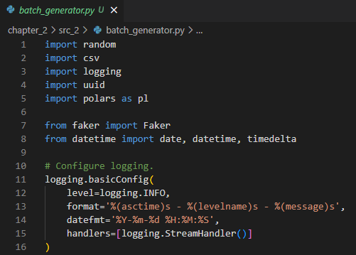

Example of logs from *next* run:\
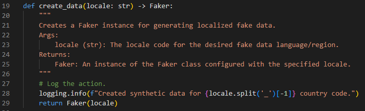

Once data generation is done in `data_2` directory is available `batch_20024-09-14.csv` CSV file that contains all 16 columns and 100.372 rows. In this CSV file are contained ingested source data (data that should be available via API). This is the bronze layer (raw zone) and data became raw data.

### Transform data
Once the raw data are in bronze layer it be transformed and moved to the silver layer.

#### Bronze layer
Open pgAdmin 4 and create a new Server. `Right-click` on server icon and choose `Register` -> `Server`.\


In opened dialog box in `General` section introduce *DataDriven* name for the server.\
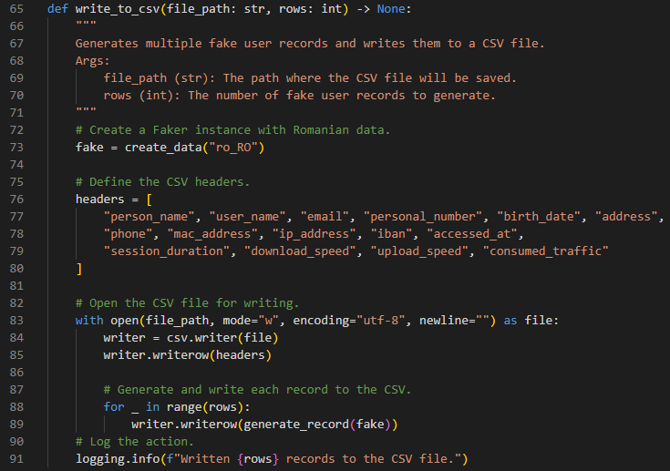

In `Connection` section introduce *localhost* as *Host name*, *postgres* as *Username* and a *password* for your server and press `Save`.\
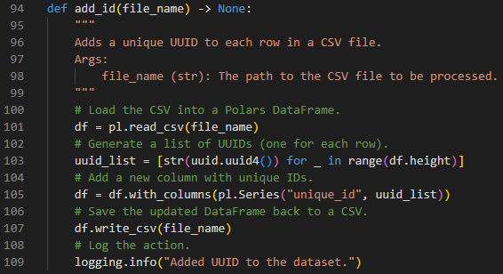

In new created server create a database by `Right-click` on *DataDriven* server, choose `Create` -> `Database`.\
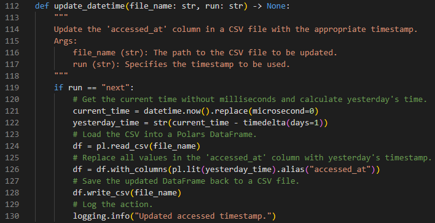

In opened dialog box in *General* section introduce *datadriven_db* as *Database* and press `Save`.\
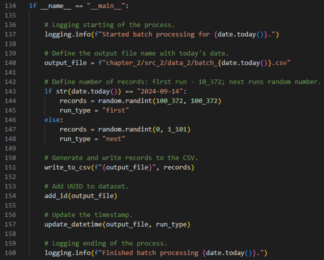

Now the database is available with a *public* schema and without tables.\


`Right-click` on *Tables* icon and choose `Create` -> `Table`.
In opened dialog box introduce the *batch_first_load* as *Name*.\
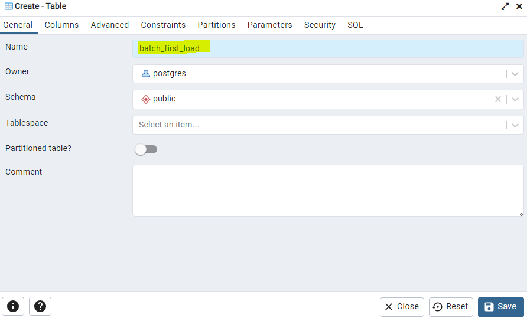

In *Columns* section introduce all necessary columns one by one.\


Also, in *Columns* section for each introduced column define the data type for this column.\
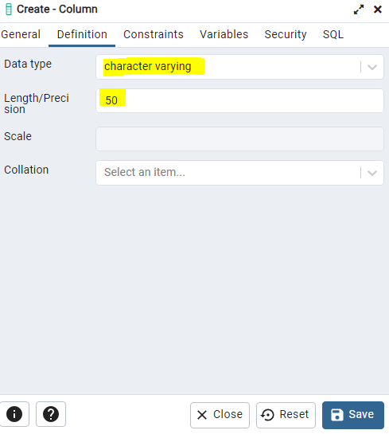

Here are presented all columns and their data types and also a sample how the columns and their data types should look like in pgAdmin 4.
```
person_name character varying (100)
user_name character varying (100)
email character varying (100)
personal_number numeric
birth_date character varying (100)
address character varying (100)
phone character varying (100)
mac_address character varying (100)
ip_address character varying (100)
iban character varying (100)
accessed_at time without time zone
session_duration integer
download_speed integer
upload_speed integer
consumed_traffic integer
unique_id character varying (100)
```


In *Tables* section now is present *batch_first_load* table.\
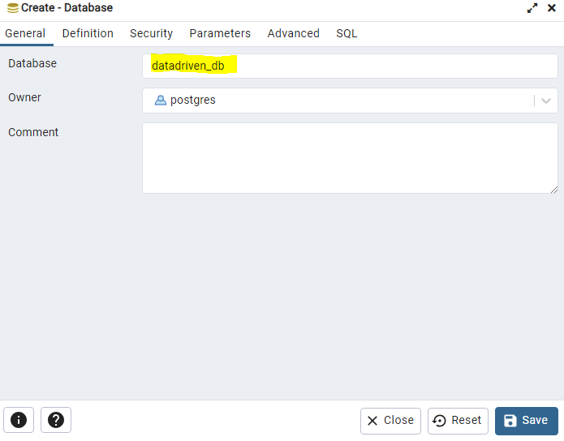

The table is created and the columns defined, but the table contains no data. In order to upload source data `Right-click` on table icon choose `Import/Export data` option and in *General* section select the CSV file to be loaded. Make sure that in the *Options* section the `Header` option is `On`.\
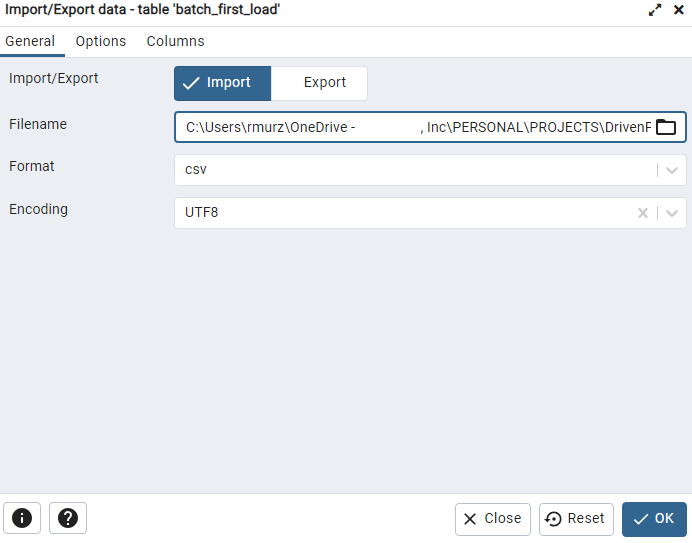

If you move to the *Columns* section there should be visible all available columns. If the columns are not available make sure that table columns were defined correct. After all settings are done press `OK`.\


If all previous steps were performed correct the result should show a pop-up window with *Process completed*. If here is a *Process failed* message update previous step by riding message from current window.\
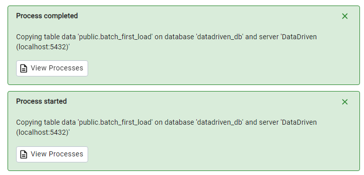

`Right-click` on the table icon and choose `Query tool` option. Use SQL query from `select_all_raw_data.sql` file to retrieve a sample of **raw data**.
```
SELECT
    *
FROM
    batch_first_load
LIMIT
    10
```


Navigate to *Schemas* from the *datadriven_db* database and `Right-click` on it, choose `Create` -> `Schema` option, introduce *bronze_layer* as a *Name* and press `Save`. Repeat this for *silver_layer* and *golden_layer* schemas. In *bronze_layer* repeat all operations for create *batch_first_load* table and load source data in order to obtain raw data in necessary schema - *bronze_layer*.\
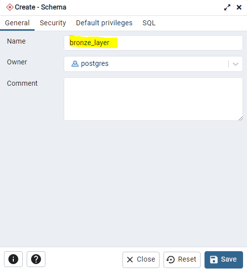

#### Silver layer
The main transformation from raw zone to staging zone will be to make data modelling. At this stage data modelling will consist in normalize data, adjust data types if necessary, and handle missing values or duplicates.

**Missing values**\
To check in bronze layer if there are missing values use `check_missing_values` SQL query in *pgAdmin 4*. If any missing value follow best practices to handle this. In current table there no missing data.
```
SELECT 
	COUNT(*) AS null_values
FROM
	bronze_layer.batch_first_load
WHERE
	person_name IS NULL
	OR user_name IS NULL
	OR email IS NULL
	OR personal_number IS NULL
	OR birth_date IS NULL
	OR address IS NULL
	OR phone IS NULL
	OR mac_address IS NULL
	OR ip_address IS NULL
	OR iban IS NULL
	OR accessed_at IS NULL
	OR session_duration IS NULL
	OR download_speed IS NULL
	OR upload_speed IS NULL
	OR consumed_traffic IS NULL
	OR unique_id IS NULL
```

**Duplicate values**\
To check in bronze layer if there are duplicate values use `check_duplicate_values` SQL query in *pgAdmin 4*. If any duplicate value follow best practices to handle this. In current table there no duplicate data.
```
SELECT
	*,
	COUNT(*) AS duplicated_values
FROM
	bronze_layer.batch_first_load
GROUP BY (
	person_name, user_name, email, personal_number,
	birth_date, address, phone, mac_address, ip_address,
	iban,accessed_at, session_duration, download_speed,
	upload_speed,consumed_traffic, unique_id
)
HAVING COUNT(*) > 1
```

For normalization will be used *Star Schema* that split initial table in five different tables. There is a fact table that contain all fields related to the activities and four tables for dimensional data.\
Open [Draw.io](https://app.diagrams.net/) tool and upload existing `star_schema.drawio` schema from `docs_2` directory. Update schema based on your needs and save it. Below will be created one fact table and four dimensional tables.


Copy `create_dim_address` SQL query in *pgAdmin 4* to create *dim_address* table.
```
CREATE TABLE
	silver_layer.dim_address AS
SELECT
	unique_id,
	address,
	mac_address,
	ip_address
FROM
	bronze_layer.batch_first_load
```
Copy `create_dim_data` SQL query in *pgAdmin 4* to create *dim_date* table.
```
CREATE TABLE
	silver_layer.dim_date AS
SELECT
	unique_id,
	accessed_at
FROM
	bronze_layer.batch_first_load
```
Copy `create_dim_finance` SQL query in *pgAdmin 4* to create *dim_finance* table.
```
CREATE TABLE
	silver_layer.dim_finance AS
SELECT
	unique_id,
	iban
FROM
	bronze_layer.batch_first_load
```
Copy `create_dim_person` SQL query in *pgAdmin 4* to create *dim_person* table.
```
CREATE TABLE
	silver_layer.dim_person AS
SELECT
	unique_id,
	person_name,
	user_name,
	email,
	phone,
	birth_date,
	personal_number
FROM
	bronze_layer.batch_first_load
```
Copy `create_fact_network_usage` SQL query in *pgAdmin 4* to create *fact_network_usage* table.
```
CREATE TABLE
	silver_layer.fact_network_usage AS
SELECT
	unique_id,
	session_duration,
	download_speed,
	upload_speed,
	consumed_traffic
FROM
	bronze_layer.batch_first_load
```

### Load data
Once the data are in silver layer it be loaded to the golden layer. At this stage will be added some more logic to the existing tables and data will denormalize for different use cases. There will be a table in golden layer for calculation of daily payment bill amount for each user for *Financial Department* and another table for internet connection issue reporting for *Support Department*. Also, will be provided two denormalized tables with PII and non-PII data for future usage (these cases will be covered in next Chapters).

#### Financial Data
The table for financial usage will contain some calculus base don existing columns. The new table will contain all involved columns and one added column *payment_amount* that will store calculated value for payment for each user. Also, there will be the unique_id for user identification.
The formula for payment calculus involve: download_speed, upload_speed, session_duration, and consumed_traffic columns.
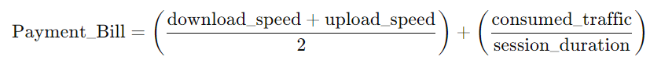

To create the new golden layer table *payment_data* for Financial Department use `create_fin_dep` SQL query.
```
CREATE TABLE
	golden_layer.payment_data AS
SELECT
	fnu.unique_id,
	df.iban,
	fnu.download_speed,
	fnu.upload_speed,
	fnu.session_duration,
	fnu.consumed_traffic,
	((fnu.download_speed + fnu.upload_speed + 1)/2) + (fnu.consumed_traffic / (fnu.session_duration + 1)) AS payment_amount
FROM
	silver_layer.fact_network_usage fnu
JOIN
	silver_layer.dim_finance df
ON
	fnu.unique_id = df.unique_id
```

To see result for the table *payment_data* for Financial Department use `select_fin_dep` SQL query.
```
SELECT
	*
FROM
	golden_layer.payment_data
LIMIT
	10
```
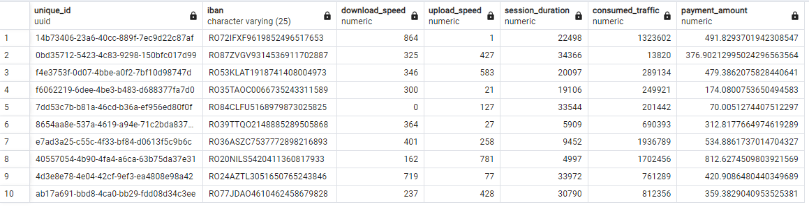

#### Support Data
The table for technical support usage will contain unique_id, address, mac_address, ip_address, download_speed, upload_speed, session_duration, and additional column *technical_data* with type boolean. The column *technical_data* will have value *true* if download_speed will be less than 50 MB, upload_speed will be less than 30 MB, and session_duration less than 1 min.

To create the new golden layer table *technical_data* for Technical Support Department use `create_tech_dep` SQL query.
```
CREATE TABLE
	golden_layer.technical_data AS
SELECT
	fnu.unique_id,
	da.address,
	da.mac_address,
	da.ip_address,
	fnu.download_speed,
	fnu.upload_speed,
	ROUND((fnu.session_duration/60), 1) as min_session_duration,
	CASE 
        WHEN fnu.download_speed < 50 OR fnu.upload_speed < 30 OR fnu.session_duration/60 < 1 THEN true
        ELSE false
    END AS technical_issue
FROM
	silver_layer.fact_network_usage fnu
JOIN
	silver_layer.dim_address da
ON
	fnu.unique_id = da.unique_id
```

To see result for the table *technical_data* for Financial Department use `select_tech_dep` SQL query.
```
SELECT
	*
FROM
	golden_layer.technical_data
LIMIT
	10
```
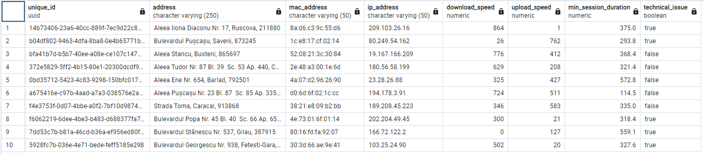


#### Non-PII Data
The table for non-PII data is denormalized table that contains all necessary columns, but columns that contains sensitive information are masked or obfuscated.

To create the new golden layer table *non_pii_data* for future use run `create_non_pii_data` SQL query.
```
CREATE TABLE
	golden_layer.non_pii_data AS
SELECT
	'***MASKED***' AS person_name,
	SUBSTRING(dp.user_name, 1, 5) || '*****'  user_name,
	SUBSTRING(dp.email, 1, 5) || '*****' AS email,
	'***MASKED***'  AS personal_number, 
	'***MASKED***' AS birth_date, 
	'***MASKED***' AS address,
	'***MASKED***'  AS phone, 
	SUBSTRING(da.mac_address, 1, 5) || '*****' AS mac_address,
	SUBSTRING(da.ip_address, 1, 5) || '*****' AS ip_address,
	SUBSTRING(df.iban, 1, 5) || '*****' AS iban,
	dd.accessed_at,
	fnu.session_duration,
	fnu.download_speed,
	fnu.upload_speed,
	fnu.consumed_traffic,
	fnu.unique_id
FROM
	silver_layer.fact_network_usage fnu
INNER JOIN
	silver_layer.dim_address da ON fnu.unique_id = da.unique_id
INNER JOIN
	silver_layer.dim_date dd ON da.unique_id = dd.unique_id
INNER JOIN
	silver_layer.dim_finance df ON dd.unique_id = df.unique_id
INNER JOIN
	silver_layer.dim_person dp ON df.unique_id = dp.unique_id
```

To see result for the table *non_pii_data* for future use run `select_non_pii_data` SQL query.
```
SELECT
	*
FROM
	golden_layer.non_pii_data
LIMIT
	10
```
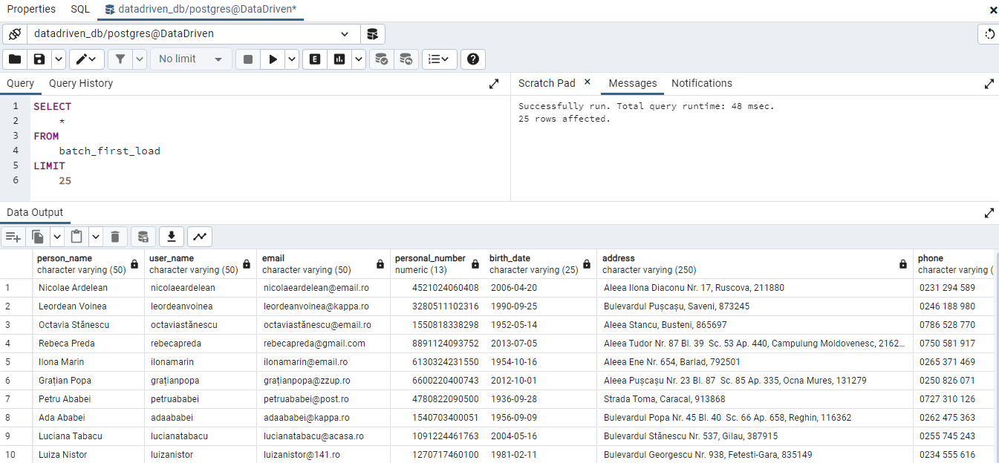

#### PII Data
The table for PII data is denormalized table that contains all necessary columns.

To create the new golden layer table *pii_data* for future use run `create_pii_data` SQL query.
```
CREATE TABLE
	golden_layer.pii_data AS
SELECT
	dp.person_name,
	dp.user_name,
	dp.email,
	dp.personal_number, 
	dp.birth_date, 
	da.address,
	dp.phone, 
	da.mac_address,
	da.ip_address,
	df.iban,
	dd.accessed_at,
	fnu.session_duration,
	fnu.download_speed,
	fnu.upload_speed,
	fnu.consumed_traffic,
	fnu.unique_id
FROM
	silver_layer.fact_network_usage fnu
INNER JOIN
	silver_layer.dim_address da ON fnu.unique_id = da.unique_id
INNER JOIN
	silver_layer.dim_date dd ON da.unique_id = dd.unique_id
INNER JOIN
	silver_layer.dim_finance df ON dd.unique_id = df.unique_id
INNER JOIN
	silver_layer.dim_person dp ON df.unique_id = dp.unique_id
```

To see result for the table *pii_data* for future use run `select_pii_data` SQL query.
```
SELECT
	*
FROM
	golden_layer.pii_data
LIMIT
	10
```
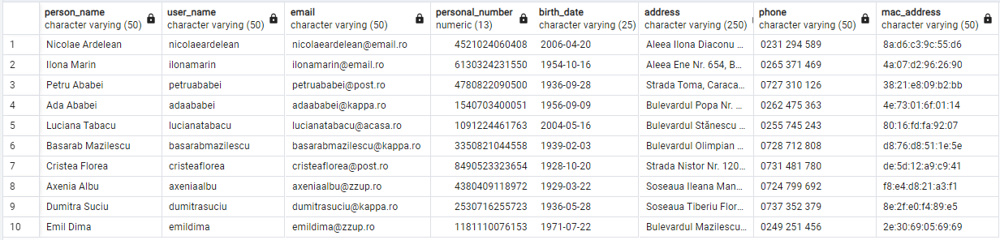