# **Chapter 5:** Batch processing - *Cloud: Automated pipeline*

**NOTE:** This chapter involves working with cloud services that are charged by the cloud provider. Consult the [AWS Pricing Calculator](https://calculator.aws/#/) for a forecast of the estimated cost of the services used in this chapter. If you proceed with this chapter, you do so at your own responsibility, and the author has no responsibility for the resulting bill.

## Scenario
For the fifth chapter/sprint, you need to automate the pipeline that was developed on AWS Cloud via the Console. The pipeline should be deployable, updatable, and destroyable on demand in an automated manner.

## Assignment
For this Sprint / Chapter your tasks include:
1. **Read** the following topics in the [Theory](#theory) section:\
    a. Terraform.

2. **Implement** the steps in the [Practice](#practice) section for *DataDriven* company:\
    a. Setup Services:
    * i. Create IAM user.
    * ii. Create Access key.
    * iii. Setup AWS CLI.
    * iv. Setup Terraform.
    
    b. Run Test Terraform:
    * i. Prepare Test Terraform.
    * ii. Run Terraform init.
    * iii. Run Terraform plan.
    * iv. Run Terraform apply.
    * v. Run Terraform destroy.

    c. Develop Terraform:
    * i. Prepare Terraform code.
    * ii. Run Terraform init.
    * iii. Run Terraform plan.
    * iv. Run Terraform apply.
    * v. Check deployed pipeline.
    * vi. Run Terraform destroy.

3. **Complete** tasks for *LeadData* company:
    * Review the *Scenario* section, complete the stages in the *Assignment*, and document your work in `work_5/scenario_5.md`. Store all evidence of your work in the `work_5` directory.

## Theory
The main theoretical notions for the chapter along with resources for self-paced learning.

### Terraform
#### Description
HashiCorp Terraform is an infrastructure as code tool that lets you define both cloud and on-prem resources in human-readable configuration files that you can version, reuse, and share. You can then use a consistent workflow to provision and manage all of your infrastructure throughout its lifecycle. Terraform can manage low-level components like compute, storage, and networking resources, as well as high-level components like DNS entries and SaaS features.
#### References
[HashiCorp - What is Terraform?](https://developer.hashicorp.com/terraform/intro)\
[IBM - What is Terraform?](https://www.ibm.com/topics/terraform)\
[GitHub - Terraform](https://github.com/hashicorp/terraform)

## Practice
Implementation for the practical part of the chapter.

### Setup services
Before proceed to automate the infrastructure, it is required to set up few things such as: create an IAM user in AWS, install AWS CLI, and install Terraform on your local machine.

#### Create IAM user
Login to your AWS account with the *root* user. Navigate to *IAM* service and choose `Users` option. Press `Create user` and provide a name to your user, recommended to be `admin` as it will have the same / almost the same rights as the *root* user. Check the `Provide user access to the AWS Management Console` option and choose `I want to create an IAM user`. For *Console password* choose any as the password will be reset on fist login and press `Next`. From `Permissions options` choose `Attach policies directly` and select `AdministratorAccess` policy. Press `Create user`.\
You'll receive URL for Console login, username, and password.
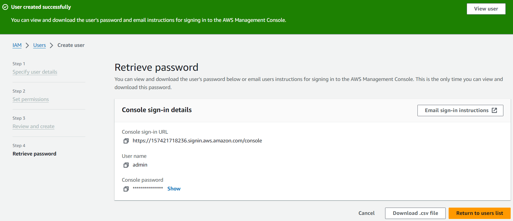

Using received URL login to your account via created user `admin`. Use *Account ID* from your account.\


You'll be asked to reset the password. Introduce the old password that was generated on user creation process or password that you provided at that stage.
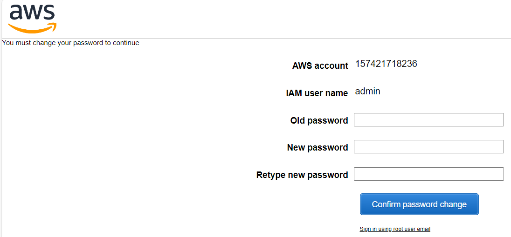

After login with the `admin` user, you'll see that instead of your account name there is specified the *admin* user.\
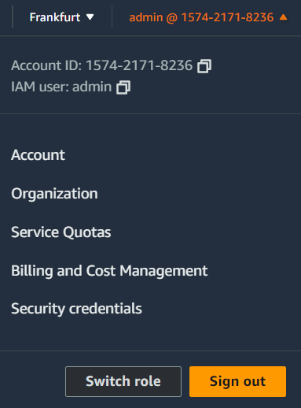

#### Generate Access key
Navigate to *IAM* service and choose *Users* section. Select user that was created previously. In *Summary* section press `Create access key` option. For *Access key best practices & alternatives* choose `Command Line Interface` option.
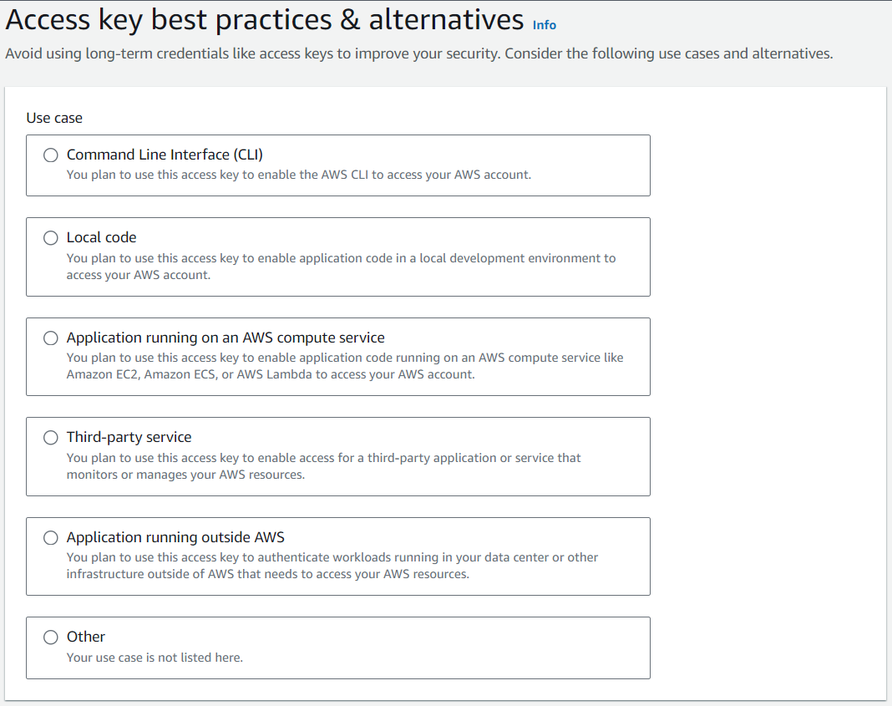

It will generate Access key and Secret access key, save these values as the Secret access key is available just once and press `Done`.
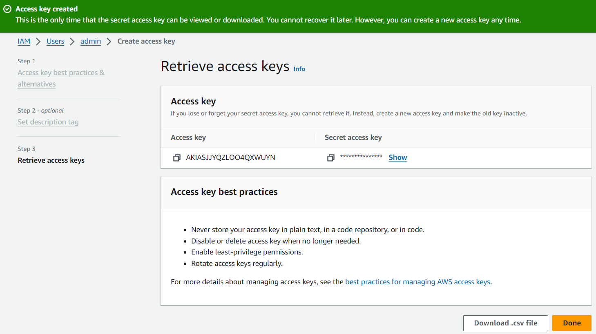

Now you can see that the user `admin` has one active *Access key* and when it was generated.\
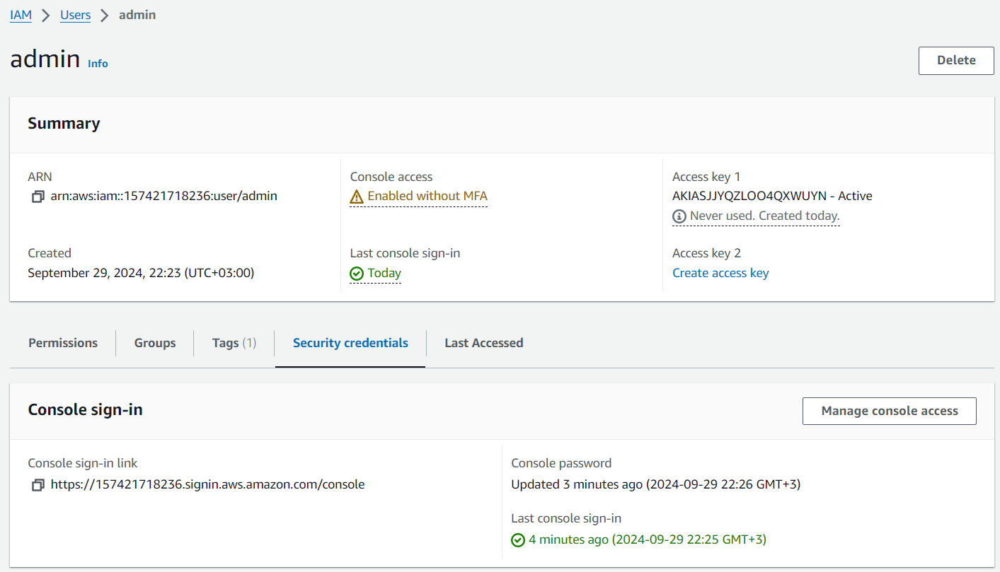

#### Setup AWS CLI
Open a terminal and enter `aws --version` command to check if the *AWS CLI* is installed on your machine. If there is a message *aws is not recognized as an internal or external command*, follow the documentation to [Install or update to the latest version of the AWS CLI](https://docs.aws.amazon.com/cli/latest/userguide/getting-started-install.html#:~:text=Learn%20how%20to%20download%20and%20install). 
```
aws --version
```
After installing the *AWS CLI* check one more time the version of the *AWS CLI* on your machine. You should see *aws-cli n.nn.nn* this message indicates that installation was successful.\
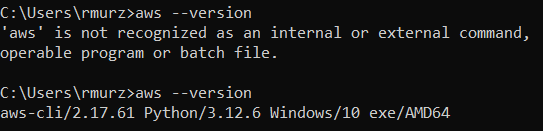

Once the *AWS CLI* was installed, in terminal introduce the command `aws configure`, and introduce *AWS Access Key ID* that you saved previously, *AWS Secret Access Key* that you saved previously, *Default region name* as `eu-central-1`, and *Default output format* as `json` and press `Enter`.
```
aws configure
```
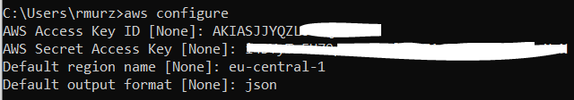

#### Setup Terraform
Open a terminal and enter `terraform version` command to check if the *Terraform* is installed on your machine. If there is a message *terraform is not recognized as an internal or external command*, follow the documentation to [Install Terraform](https://developer.hashicorp.com/terraform/install?product_intent=terraform). 
```
terraform version
```
After installing the *Terraform* check one more time the version of the *Terraform* on your machine. You should see *Terraform vn.nn.nn* this message indicates that installation was successful. 


### Run Test Terraform
Before starting to develop infrastructure code for *DrivenData* pipeline, it will be tested the setup. For setup test it will be deployed a test S3 bucket named `example-terraform-bucket-test`.

#### Prepare Test Terraform
Create `test_terraform` directory and inside create `main.tf` file and paste the code below.
```
provider "aws" {
  region = "eu-central-1"
}
```
In same directory create `s3.tf` file and copy the content below.
The code for `main.tf` and `s3.tf` can be found in `src_5/test_terraform` directory.
```
resource "aws_s3_bucket" "s3_bucket" {
  bucket = "example-terraform-bucket-test"
}
```

#### Run Terraform init
In terminal navigate to the `test_terraform` directory and run `terraform init` command. This command will initialize terraform in this directory and will track the infrastructure in this directory.
```
terraform init
```
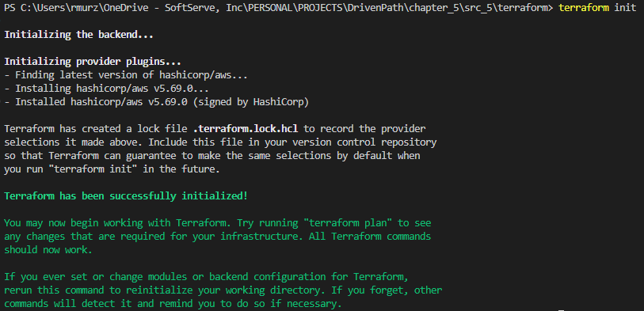

#### Run Terraform plan
In terminal run `terraform plan` command this command will prepare the resources to be deployed to the cloud, will check if there are no conflicts, and will display what resources will be created, updated, or deleted.
```
terraform plan
```
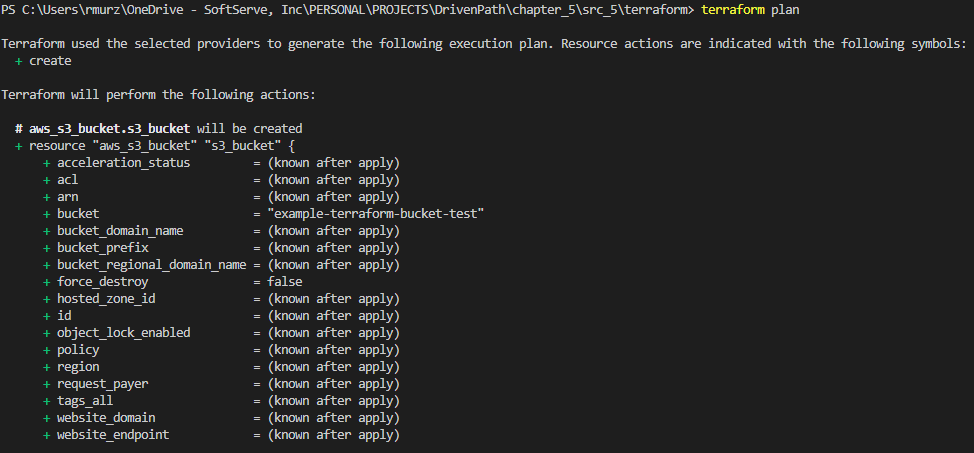

#### Run Terraform apply
In terminal run `terraform apply` command this command will apply all changes in the infrastructure that were planned on plan stage and the resources will be deployed to the cloud. You should type `yes` if you agree with all changes that will be made and press `Enter`.
```
terraform apply
```
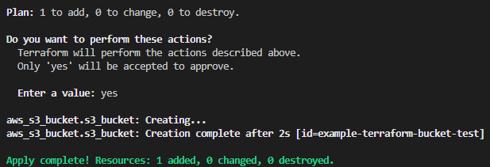

Now you can navigate to *S3* service and see if the bucket was deployed. You should see the bucket with the name `example-terraform-bucket-test`.\
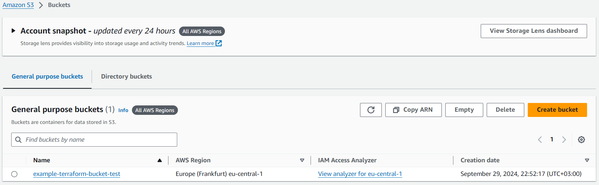

#### Run Terraform destroy
In terminal run `terraform destroy` command this command will destroy all changes in the infrastructure that were planned on plan stage and the resources will be deleted from the cloud. You should type `yes` if you agree with all changes that will be made and press `Enter`.
```
terraform destroy
```
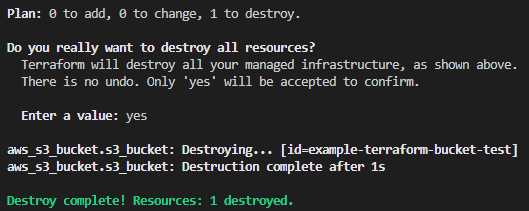

### Develop Terraform
Create `terraform` directory. All project infrastructure code will go to the `terraform` directory. The main steps will remain the same as on *Testing Terraform* step, but with all resources involved in the pipeline developed in previous chapter.\
All resources will be provided with minimum required configuration and options.

#### Prepare Non-Terraform code
In `terraform` directory create subdirectories: `dags` for DAG files, `policies` for IAM policies, `requirements` for dependencies, and `tasks` for Glue jobs files.\
In `dags` directory copy the DAG file *driven_data_pipeline.py* from previous chapter.\
In `requirements` directory copy the *requirements.txt* file from previous chapter.\
In `tasks` directory copy the Python files *dim_address.py*, *dim_date.py*, *dim_finance.py*, *dim_person.py*, and *fact_network_usage.py* used for Glue jobs from previous chapter.

#### Prepare Terraform code
In `terraform` directory create files named `main.tf` for provider declaration, a file `variables.tf` for variables declaration, a file `terraform.tfvars` for variables values, a file `glue.tf` for database, crawlers, and Glue jobs deployment, a file `iam.tf` for IAM roles deployment, a file `mwaa.tf` for Airflow deployment, a file `s3.tf` for S3 bucket creation and copy the files to the bucket, and a file `vpc.tf` for VPC, Subnets, Security Group deployment.\
In `policies` subdirectory create a file `airflow_assume_role_policy.json.tpl` for Airflow assuming role policy, a file `airflow_execution_role_policy.json.tpl` for Airflow execution role policy, a file `glue_assume_role_policy.json.tpl` for Glue assuming role policy, and a file `glue_execution_rle_policy.json.tpl` for Glue execution role policy.

**Declare Variables**\
In `variables.tf` file paste the content from below. Here will define as variables for better management all values that are used in Terraform code at least two times. It can be noticed that some variables has *default* value and some doesn't. Those variables that has constant value for all possible environments will be declared with default values, those variables that can change the value based on environment will be stored in `terraform.tfvars` file. Copy and paste the content from below.
```
variable "account_id" {
  description = "The Account ID of the AWS."
  type        = string
}

variable "region" {
  description = "The region of the DrivenData pipeline."
  type        = string
}

variable "tag" {
  description = "The tag for DrivenData pipeline."
  default     = "driven_data"
}

variable "bucket_name" {
  description = "The name of the S3 bucket."
  type        = string
  default     = "driven-data-bucket"
}

variable "mwaa_name" {
  description = "The name of the MWAA environment."
  type        = string
  default     = "driven-data-airflow-environment"
}

variable "personal_public_ip" {
  description = "The Personal Public IP."
  type        = string
}
```
For variables that can change the value based on environment copy the content from below to `terraform.tfvars` file. Replace *ACCOUNT_ID* and *PUBLIC_IP* with your values.
```
account_id         = ACCOUNT_ID
region             = "eu-central-1"
personal_public_ip = PUBLIC_IP
```
**Define Amazon Web Services provider**\
In `main.tf` file paste the content from below. The provider used is *aws* and the resources will be deployed in *eu-central-1* region.
```
provider "aws" {
  region = var.region
}
```
**Define Simple Storage Service bucket**\
In `s3.tf` file paste the content from below. This will deploy a bucket with default configurations with name *driven-data-bucket*. The whole content of the file can be found in `chapter_5/src_5/terraform/s3.tf`.
```
resource "aws_s3_bucket" "driven_data_bucket" {
  bucket = var.bucket_name
  tags = {
    Name = var.tag
  }
}
```
In order to copy the DAG, requirements, and tasks files use block of code as below. The copy resources for all subdirectories content can be found in `chapter_5/src_5/terraform/s3.tf` file.
```
resource "aws_s3_object" "copy_dags" {
  for_each = fileset("dags/", "*")
  bucket   = aws_s3_bucket.driven_data_bucket.id
  key      = "dags/${each.value}"
  source   = "dags/${each.value}"
  etag     = filemd5("dags/${each.value}")
}
```
**Define Virtual Private Cloud**\
In `vpc.tf` file paste the content from below. This will deploy a VPC, two public subnets and two private subnets necessary for MWAA, also it will deploy an Internet Gateway and will map subnets to the Internet Gateway. Code block for the VPC.
```
resource "aws_vpc" "mwaa_vpc" {
  cidr_block           = "10.0.0.0/16"
  enable_dns_support   = true
  enable_dns_hostnames = true
  tags = {
    Name = var.tag
  }
}
```
Code block for the Subnet. The full code is in `chapter_5/src_5/terraform/vpc.tf` file.
```
resource "aws_subnet" "public_subnet_1" {
  vpc_id            = aws_vpc.mwaa_vpc.id
  cidr_block        = "10.0.3.0/24"
  availability_zone = "${var.region}a"
  tags = {
    Name = var.tag
  }
}
```
Code block for the Internet Gateway.
```
resource "aws_internet_gateway" "mwaa_igw" {
  vpc_id = aws_vpc.mwaa_vpc.id
  tags = {
    Name = var.tag
  }
}
```
Code block for the Security Group. Paste the content from below. This will deploy a Security Group used for traffic control on Airflow. It will allow inbound traffic on a specific port and outbound traffic for all ports.
```
resource "aws_security_group" "mwaa_sg" {
  vpc_id = aws_vpc.mwaa_vpc.id
  ingress {
    from_port   = 443
    to_port     = 443
    protocol    = "tcp"
    cidr_blocks = [var.personal_public_ip]
  }
  egress {
    from_port   = 0
    to_port     = 0
    protocol    = "-1"
    cidr_blocks = ["0.0.0.0/0"]
  }
  tags = {
    Name = var.tag
  }
}
```
Code block for the Route Table. Paste the content from below. This will deploy a Route Table and will associate it with the Public Subnet. The full code is in `chapter_5/src_5/terraform/vpc.tf` file.
```
resource "aws_route_table" "public_route_table" {
  vpc_id = aws_vpc.mwaa_vpc.id
  route {
    cidr_block = "0.0.0.0/0"
    gateway_id = aws_internet_gateway.mwaa_igw.id
  }
  tags = {
    Name = var.tag
  }
}

resource "aws_route_table_association" "public_subnet_1_assoc" {
  subnet_id      = aws_subnet.public_subnet_1.id
  route_table_id = aws_route_table.public_route_table.id
}
```
**Define Identity and Access Management**\
In `iam.tf` file copy the content from below to create *Airflow* user and policy. Also, attach the policy to the user. The full code is in `chapter_5/src_5/terraform/iam.tf` file. There is also declaration of the *Glue* role used for execution of the Glue jobs.
```
resource "aws_iam_role" "mwaa_execution_role" {
  name               = "mwaa_execution_role"
  description        = "Role for MWAA execution."
  assume_role_policy = templatefile("${path.module}/policies/airflow_assume_role_policy.json.tpl", {})
  tags = {
    Name = var.tag
  }
}

resource "aws_iam_policy" "mwaa_policy" {
  name        = "mwaa_execution_policy"
  description = "Policy for MWAA permissions."

  policy = templatefile("${path.module}/policies/airflow_execution_role_policy.json.tpl", {
    region      = var.region
    account_id  = var.account_id
    bucket_name = var.bucket_name
    mwaa_name   = var.mwaa_name
  })
}

resource "aws_iam_role_policy_attachment" "mwaa_role_policy_attachment" {
  role       = aws_iam_role.mwaa_execution_role.name
  policy_arn = aws_iam_policy.mwaa_policy.arn
}
```
For *Airflow* policy to be used by the *Airflow* role paste the content from below to the `airflow_assume_role_policy.json.tpl` file. Copy the content for all policies from `policies` directory.
```
{
    "Version": "2012-10-17",
    "Statement": [
      {
        "Effect": "Allow",
        "Principal": {
            "Service": [
                "airflow.amazonaws.com",
                "airflow-env.amazonaws.com"
                ]
        },
        "Action": "sts:AssumeRole"
      }
   ]
}
```
**Define Glue**\
In `glue.tf` file define the database, crawlers, and Glue jobs to be used in the *DrivenData* pipeline.\
For the *database* copy the content from below, it will deploy a database that will contain all data from the pipeline.
```
resource "aws_glue_catalog_database" "driven_data_db" {
  name = "driven_data_db"
  description = "Database for DrivenData data."
  tags = {
    Name = var.tag
  }
}
```
For crawler that will update raw data from S3 to the database copy content from below. The full code is in `chapter_5/src_5/terraform/glue.tf` file.
```
resource "aws_glue_crawler" "raw_driven_data_crawler" {
  name          = "raw_driven_data_crawler"
  role          = aws_iam_role.glue_execution_role.arn
  database_name = aws_glue_catalog_database.driven_data_db.name
  description   = "Crawls data in S3 and creates table in Glue database for raw data."
  s3_target {
    path = "${aws_s3_bucket.driven_data_bucket.bucket}/data/raw/"
  }
  tags = {
    Name = var.tag
  }
}
```
For Glue job that will transform and move data from raw to staging address table copy content from below. The full code is in `chapter_5/src_5/terraform/glue.tf` file.
```
resource "aws_glue_job" "staging_dim_address_glue" {
  name        = "staging_dim_address_glue"
  description = "Glue job to transform data from raw to staging address."
  role_arn    = aws_iam_role.glue_execution_role.arn
  command {
    name            = "pythonshell"
    python_version  = "3.9"
    script_location = "s3://${aws_s3_bucket.driven_data_bucket.bucket}/tasks/dim_address.py"
  }
  tags = {
    Name = var.tag
  }
}
```
**Define Managed Workflows for Apache Airflow**\
In `mwaa.tf` file define the Airflow environment used to orchestrate the *DrivenData* pipeline.
```
resource "aws_mwaa_environment" "mwaa_env" {
  name                 = var.mwaa_name
  airflow_version      = "2.9.2"
  execution_role_arn   = aws_iam_role.mwaa_execution_role.arn
  source_bucket_arn    = aws_s3_bucket.driven_data_bucket.arn
  max_workers          = 5
  min_workers          = 1
  environment_class    = "mw1.small"
  dag_s3_path          = "dags"
  requirements_s3_path = "requirements.txt"
  network_configuration {
    security_group_ids = [aws_security_group.mwaa_sg.id]
    subnet_ids         = [aws_subnet.private_subnet_1.id, aws_subnet.private_subnet_2.id]
  }
  logging_configuration {
    task_logs {
      enabled = true
      log_level = "INFO"
    }
    scheduler_logs {
      enabled = true
      log_level = "INFO"
    }
    webserver_logs {
      enabled = true
      log_level = "INFO"
    }
    worker_logs {
      enabled = true
      log_level = "INFO"
    }
    dag_processing_logs {
      enabled = true
      log_level = "INFO"
    }
  }
  webserver_access_mode = "PUBLIC_ONLY"
  tags = {
    Name = var.tag
  }
}
```

#### Run Terraform init
In terminal navigate to the *terraform* directory and initialize terraform in this directory using command below.
```
terraform init
```

#### Run Terraform plan
Run command below to investigate if any error will occur during deployment and to analyze what resources will be deployed.
```
terraform plan
```
After running the command above terraform will give a detailed plan with resources that will be deployed. A snapshot of the statement of *plan* command is presented below. You can see that it will perform next changes: *42 to add, 0 to change, 0 to destroy*.
```
Terraform used the selected providers to generate the following execution plan. Resource actions are indicated with the following symbols:
  + create

Terraform will perform the following actions:

  # aws_iam_role_policy_attachment.mwaa_role_policy_attachment will be created
  + resource "aws_iam_role_policy_attachment" "mwaa_role_policy_attachment" {
      + id         = (known after apply)
      + policy_arn = (known after apply)
      + role       = "mwaa_execution_role"
    }

  # aws_iam_service_linked_role.airflow_linked_role will be created
  + resource "aws_iam_service_linked_role" "airflow_linked_role" {
      + arn              = (known after apply)
      + aws_service_name = "aws.amazonaws.com"
      + create_date      = (known after apply)
      + id               = (known after apply)
      + name             = (known after apply)
      + path             = (known after apply)
      + tags             = {
          + "Name" = "driven_data"
        }
      + tags_all         = {
          + "Name" = "driven_data"
        }
      + unique_id        = (known after apply)
    }

  # aws_internet_gateway.mwaa_igw will be created
  + resource "aws_internet_gateway" "mwaa_igw" {
      + arn      = (known after apply)
      + id       = (known after apply)
      + owner_id = (known after apply)
      + tags     = {
          + "Name" = "driven_data"
        }
      + tags_all = {
          + "Name" = "driven_data"
        }
      + vpc_id   = (known after apply)
    }

Plan: 42 to add, 0 to change, 0 to destroy.
```

#### Run Terraform apply
Run the command below to apply the changes that were presented in *plan*. After running the command introduce `yes` if you agree with the changes that will be applied to the cloud infrastructure.
```
terraform apply
```
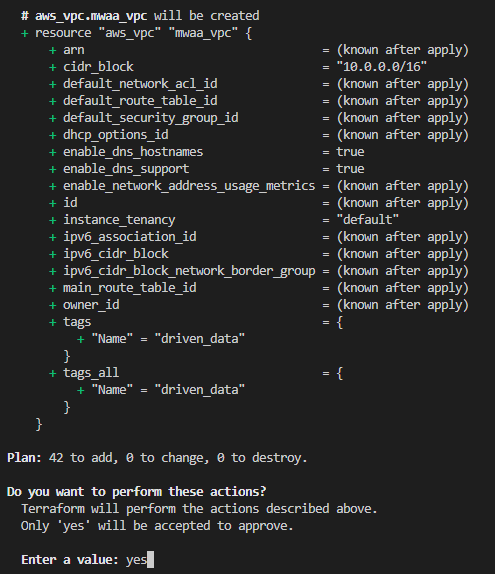

Below is a snapshot of the terraform applying process. It will take ~1h to deploy all resources for *DrivenData* pipeline.
```
aws_glue_catalog_database.staging_dim_address_db: Creating...
aws_vpc.mwaa_vpc: Creating...
aws_glue_catalog_database.staging_dim_date_db: Creating...
aws_glue_catalog_database.staging_dim_finance_db: Creating...
aws_glue_catalog_database.staging_dim_person_db: Creating...
aws_glue_catalog_database.staging_fact_network_usage_db: Creating...
aws_iam_role.glue_execution_role: Creating...
aws_glue_catalog_database.raw_driven_data_db: Creating...
aws_iam_role.mwaa_execution_role: Creating...
aws_s3_bucket.driven_data_bucket: Creating...
```
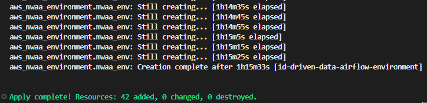

#### Check deployed pipeline
After the deployment is finished and all resources are available, the pipeline can be run.\
Navigate to the *MWAA* and will see the *driven-data-airflow-environment* available.
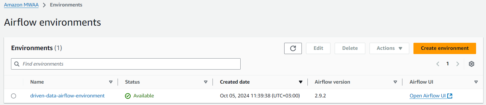

On each resource that was deployed it can be seen the tag *driven_data* available. Tagging the resources based on different keys is very important for resource management.
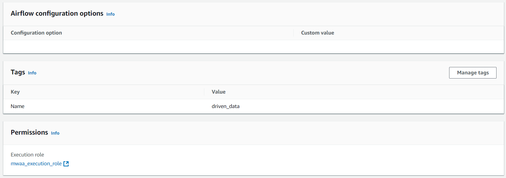

In S3 bucket are present initial created directories: *dags* and *tasks* that contains all specific files, also *requirements.txt* file.
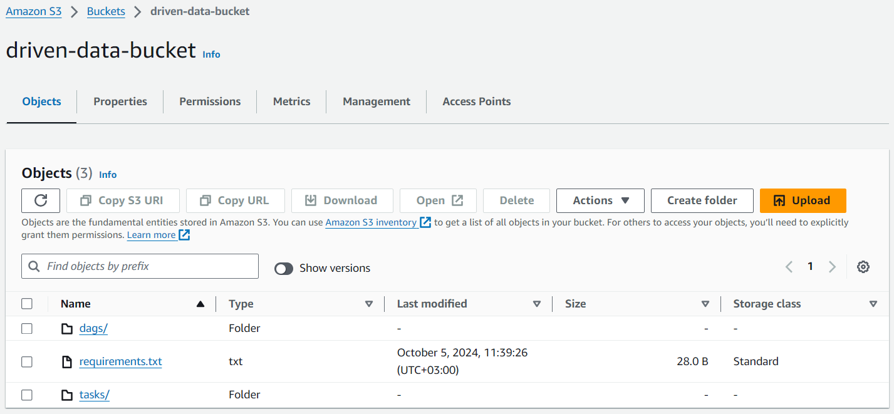

All five Glue jobs that are used in the pipeline are deployed and available.
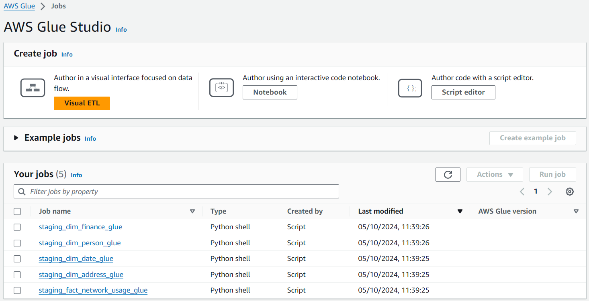

All six Crawlers that are used in the pipeline are deployed and available.
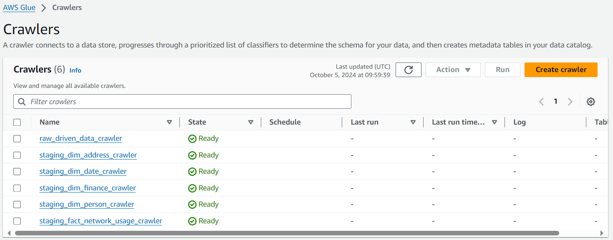

The database is also deployed and available to be used for *DrivenData* pipeline.


Roles that were declared are deployed and available to execute specific jobs for what were assigned.
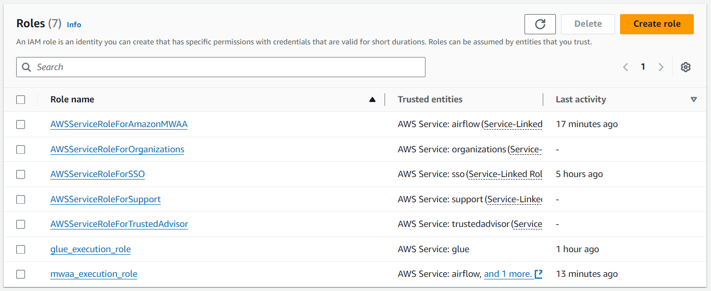

#### Run Terraform destroy
After the job is done and the resources are no more needed, destroy all deployed resources using command below.
```
terraform destroy
```
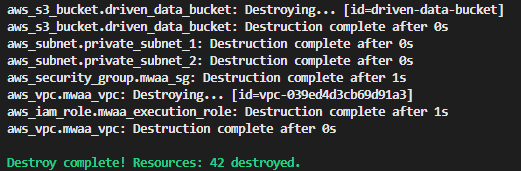

**Note:** Cloud computing is not free, deploying resources few times and running pipeline for two day costs ~30 USD. Not use billable services if you don't want to be charged by using AWS services.
