# **Chapter 7:** Streaming processing - *Local Pipeline*

## Scenario 7
For the seventh chapter/sprint, as the *DrivenData* company starts to grow rapidly and daily traffic is increasing, there are currently around 10,000 records generated per day. In addition to batch ingestion, these new records need to be ingested in real-time for analysis and alerting. To achieve this, it is necessary to investigate data streaming for *DrivenData* and understand the amount of data per time unit. Prepare a local ETL pipeline to extract data into a streaming layer, specifically in a streaming table, for consumption in the analytical process.

## Assignment
For this Sprint / Chapter your tasks include:
1. **Read** the following topics in the [Theory](#theory) section:\
    a. Streaming processing.\
    b. Kafka.\
    c. Producer.\
    d. Consumer.\
    e. Topic.

2. **Implement** the steps in the [Practice](#practice) section for *DataDriven* company:\
    a. Setup Kafka:
    * i. Create Docker Compose file.
    * ii. Run Kafka on Docker.

    b. Setup topic:
    * i. Create topic.
    * ii. Test topic.

    c. Setup producer:
    * i. Create producer.
    * ii. Produce data.

    d. Setup consumer:
    * i. Create consumer.
    * ii. Consume data.

    e. Setup database:
    * i. Prepare database.
    * ii. Check data.

    f. Stop streaming.

3. **Complete** tasks for *LeadData* company:
    * Review the *Scenario* section, complete the stages in the *Assignment*, and document your work in `work_7/scenario_7.md`. Store all evidence of your work in the `work_7` directory.

## Theory
The main theoretical notions for the chapter along with resources for self-paced learning.

### Streaming processing
#### Description
Stream processing is the processing of data in motion, or in other words, computing on data directly as it is produced or received. The majority of data are born as continuous streams: sensor events, user activity on a website, financial trades, and so on – all these data are created as a series of events over time.
#### References
[Splunk - Stream Processing: Definition, Tools, and Challenges](https://www.splunk.com/en_us/blog/learn/stream-processing.html)\
[nVidia - Stream Processing](https://www.nvidia.com/en-us/glossary/stream-processing/)\
[Medium - A Gentle Introduction to Stream Processing](https://medium.com/stream-processing/what-is-stream-processing-1eadfca11b97)

### Kafka
#### Description
Apache Kafka is a distributed event store and stream-processing platform. It is an open-source system developed by the Apache Software Foundation written in Java and Scala. The project aims to provide a unified, high-throughput, low-latency platform for handling real-time data feeds.
#### References
[Kafka - Introduction](https://kafka.apache.org/intro)\
[AWS - What is Apache Kafka?](https://aws.amazon.com/what-is/apache-kafka/)\
[Confluent - What is Apache Kafka?](https://www.confluent.io/what-is-apache-kafka/)

### Producer
#### Description
Stream processor: A stream producer (also known as a message broker) uses an API to fetch data from a producer — a data source that emits streams to the stream processor. The processor converts this data into a standard messaging format and streams this output regularly to a consumer.
#### References
[Twisted - Push Producers](https://docs.twisted.org/en/twisted-17.9.0/core/howto/producers.html#push-producers)\
[Striim - Stream processor](https://www.striim.com/blog/an-introduction-to-stream-processing/#:~:text=Stream%20processor%3A%20A%20stream%20producer,output%20regularly%20to%20a%20consumer.)

### Consumer
#### Description
Stream consumers are software components that process and analyze the data streams buffered in the processor. Each consumer has analytics capabilities like correlations, aggregations, filtering, sampling, or machine learning. Each stream can have multiple consumers, and each consumer can process numerous streams. Consumers can also send the changed data back to the processor to create new streams for other consumers.
#### References
[AWS - Stream consumers](https://aws.amazon.com/what-is/streaming-data/)\
[SeaStreamer - Consumer](https://www.sea-ql.org/SeaStreamer/docs/streamer/consumer/)

### Topic
#### Description
Topics are created in streams and contain logical collections of messages. These collections of messages are published to partitions in the topic.
#### References
[HPE - Stream Topics](https://www.hpe.com/psnow/resources/ebooks/a00110181en_us_v11/MapR_Streams/topics.html#:~:text=Topics%20are%20created%20in%20streams,to%20partitions%20in%20the%20topic.)\
[StackOverflow - Kafka: Stream vs Topic](https://stackoverflow.com/questions/62336439/kafka-stream-vs-topic)

## Practice
Implementation for the practical part of the chapter.

### Setup Kafka
In order to ingest streaming data there will need to set up a stream-processing pipeline and this will be done using Apache Kafka.\
Open Docker Desktop, pgAdmin 4, and VS Code.

#### Create Docker Compose file
In `work_7` directory create a `docker-compose.yml` file and paste the content from below. This will deploy two containers, one for Kafka and one for Zookeeper.
```
version: "3"
networks:
  drivenDataNetwork:

services:
  zookeeper:
    image: 'bitnami/zookeeper:latest'
    ports:
      - '2181:2181'
    environment:
      - ALLOW_ANONYMOUS_LOGIN=yes
    networks:
      - drivenDataNetwork

  kafka:
    image: 'bitnami/kafka:latest'
    user: root
    ports:
      - '9092:9092'
    environment:
      - KAFKA_BROKER_ID=1
      - KAFKA_LISTENERS=PLAINTEXT://:9092
      - KAFKA_ADVERTISED_LISTENERS=PLAINTEXT://127.0.0.1:9092
      - KAFKA_ZOOKEEPER_CONNECT=zookeeper:2181
      - ALLOW_PLAINTEXT_LISTENER=yes
    volumes:
      - ./Kafka:/bitnami/kafka
    networks:
      - drivenDataNetwork
    depends_on:
      - zookeeper  
```

#### Run Kafka on Docker
In terminal navigate to tg=he `work_7` directory and run the Docker compose using command from below. This command will deploy both containers described in *docker-compose.yml* file and will set up the *drivenDataNetwork* network.
```
docker compose up -d
```
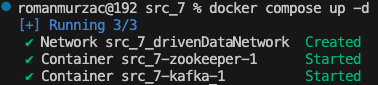

In order to see containers in terminal use the command below. This command will provide the Docker containers that are available with their metadata.
```
docker ps
```
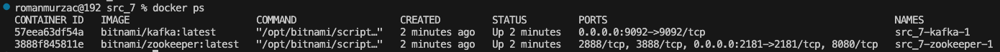

Also, the running containers and their images can be seen in the Docker Desktop, under *work_7* will be *kafka-1* and *zookeeper-1* containers running.\
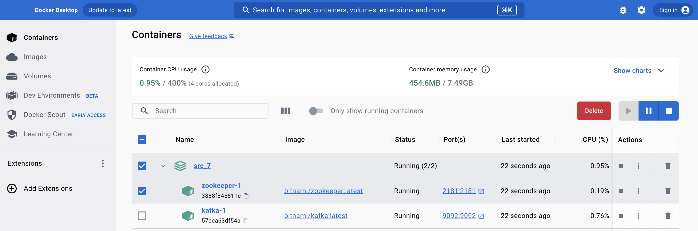

### Setup topic
In order to send produced data and to consume them there is a need to have a broker point and this is a *topic* that needs to be created.

#### Create topic
In *Docker Desktop* select *kafka-1* container and navigate to `Terminal`. In *Docker Desktop* terminal enter the command from below. It can be seen that at this moment no topics are available.
```
kafka-topics.sh --bootstrap-server localhost:9092 --list
```
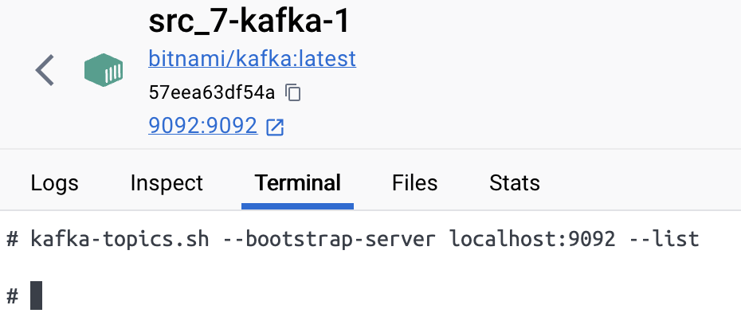

Create a topic by introducing in VS Code terminal the command from below. Replace `<container_id>` with the *id* of your *kafka-1* container id.
```
docker exec -it <container_id> kafka-topics.sh --create --bootstrap-server localhost:9092 --replication-factor 1 --partitions 3 --topic driven_data_stream
```
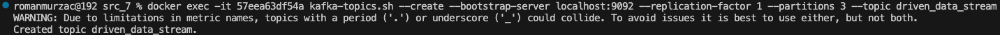

In *Docker Desktop* terminal introduce again the command that list all available topics and now there should be a topic named *driven_data_stream*.\
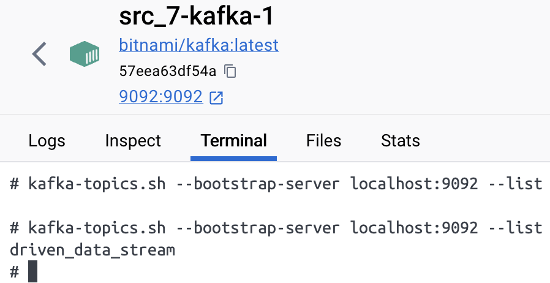

#### Test topic
Before the proper *producer* and *consumer* will be setup, as a test it can be sent via *producer* dummy data and check if *consumer* receive them.\
In order to start the *producer* enter the command from below. Replace `<container_id>` with the *id* of your *kafka-1* container id.\
Enter some test words or sentences one by one and press `Enter`.
```
docker exec -it <container_id> kafka-console-producer.sh --bootstrap-server localhost:9092 --topic driven_data_stream
```
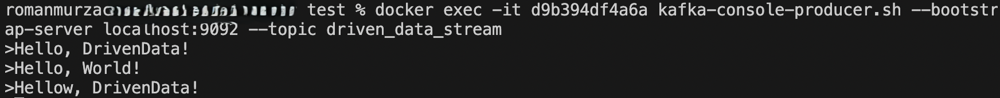

Open new terminal, navigate to the `work_7` directory. In order to start the *consumer* enter the command from below. Replace `<container_id>` with the *id* of your *kafka-1* container id. Now it can be seen that messages that were sent in *producer* are received in *consumer*, also can be seen that messages that were sent before the *consumer* was up are lost. This can be handled, but for now it is just required to start the *consumer* and after that the *producer*.\
P.S. There is an intentional mistake in word *Hellow* to see that the same is received.
```
docker exec -it <container_id> kafka-console-consumer.sh --bootstrap-server localhost:9092 --topic driven_data_stream
```
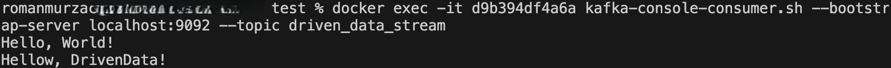

### Setup producer
The producer is software that handle produced data. In this case, data are produced as in previous chapters. Data generation part was updated a little bit to fit the output format.

#### Create producer
In `work_7` directory create a file named `streaming_producer.py`. In this file will be created few functions that will handle data generation and Kafka producer, as well, here will be the logic of execution for the producer.\
Create a function `generate_records()` that will generate synthetic data using code from below.
```
def generate_record(fake: Faker) -> list:
    streaming_data = {}
    streaming_data["person_name"] = fake.name()
    streaming_data["user_name"] = streaming_data["person_name"].replace(" ", "").lower()
    streaming_data["email"] = f'{streaming_data["user_name"]}@{fake.free_email_domain()}'
    streaming_data["personal_number"] = fake.ssn()
    streaming_data["birth_date"] = str(fake.date_of_birth())
    streaming_data["address"] = fake.address().replace("\n", ", ")
    streaming_data["phone_number"] = fake.phone_number()
    streaming_data["mac_address"] = fake.mac_address()
    streaming_data["ip_address"] = fake.ipv4()
    streaming_data["iban"] = fake.iban()
    streaming_data["accessed_at"] = str(datetime.now())
    streaming_data["session_duration"] = random.randint(0, 36_000)
    streaming_data["download_speed"] = random.randint(0, 1_000)
    streaming_data["upload_speed"] = random.randint(0, 800)
    streaming_data["consumed_traffic"] = random.randint(0, 2_000_000)
    streaming_data["unique_id"] = str(uuid.uuid4())
    return streaming_data
```

Create a function named `create_producer()` that will instantiate *KafkaProducer* using code from below.
```
def create_producer() -> KafkaProducer:
    producer = KafkaProducer(
        bootstrap_servers=['localhost:9092'],
        value_serializer=lambda v: json.dumps(v).encode('utf-8')
    )
    return producer
```

Using the code from below, create a function named `produce_data()` that will produce actual data and will be sent to the topic by the producer.
```
def produce_data(producer: KafkaProducer, topic: str) -> None:
    while True:
        synthetic_data = create_data("ro_RO")
        streaming_data = generate_record(synthetic_data)
        producer.send(topic, value=streaming_data)
        time.sleep(random.randint(1, 15))
```

Create the logic of execution in `streaming_producer.py` file using the code from below. This use the function defined above, will produce data and will send them to the specific topic.
```
if __name__ == "__main__":
    topic = "driven_data_stream"
    producer = create_producer()
    produce_data(producer, topic)
```

#### Produce data
In *VS Code* terminal run the command from below, and it should start to produce data.
```
python streaming_producer.py
```


### Setup consumer
The consumer is software that handle data from a topic. Data that are land in *drive_data_stream* will be consumed by the consumer that will be setup below.

#### Create consumer
In `work_7` directory create a file named `streaming_consumer.py`. In this file will be created few functions that will handle data ingestion using Kafka consumer, as well, here will be the logic of execution for the consumer. Schema and table also will create at this stage.\
Create a function `read_credentials()` that will read from `credentials.json` the credentials for database connection.
```
def read_credentials(file_path: str) -> dict:
    with open(file_path, 'r') as file:
        credentials = json.load(file)
    return credentials
```

Create a function `read_sql()` that will read from *SQL* files queries to create schema and table.
```
def read_sql(file_path: str) -> str:
    with open(file_path, 'r') as sql_file:
        sql_query = sql_file.read()
    return sql_query
```

Create a function named `create_consumer()` that will instantiate *KafkaConsumer* using code from below.
```
def create_consumer(topic: str) -> KafkaConsumer:
    consumer = KafkaConsumer(
        topic,
        bootstrap_servers=['localhost:9092'],
        value_deserializer=lambda v: json.loads(v.decode('utf-8')),
        auto_offset_reset='earliest',
        enable_auto_commit=True
    )
    return consumer
```

Create a function named `connect_db()` that will use credentials from *JSON* file and will create a connection to the database.
```
def connect_db(credentials: dict) -> psycopg2.connect:
    conn = psycopg2.connect(
        dbname=credentials['dbname'],
        user=credentials['user'],
        password=credentials['password'],
        host=credentials['host'],
        port=credentials['port']
    )
    return conn
```

Create a function named `create_object()` that will run a query in the database.
```
def create_object(conn: psycopg2.connect, creation_query: str) -> None:
    cursor = conn.cursor()
    cursor.execute(creation_query)
    conn.commit()
```

Using the code from below, create a function named `consume_data()` that will consume actual data and will be sent to the database.
```
def consume_data(conn: psycopg2.connect, consumer: KafkaConsumer, table_name: str) -> None:
    cursor = conn.cursor()
    for message in consumer:
        data = message.value
        columns = data.keys()  
        values = [data.get(col) for col in columns]
        query = f"INSERT INTO {table_name} ({', '.join(columns)}) VALUES ({', '.join(['%s'] * len(columns))})"
        cursor.execute(query, values)
        conn.commit()
    cursor.close()
    conn.close()
```

Create the logic of execution in `streaming_consumer.py` file using the code from below. This use the function defined above, will create the schema, will create the table, and will ingest data in the database.
```
if __name__ == "__main__":
    credentials_path = "credentials.json"
    schema_path = "create_schema.sql"
    table_path= "create_table.sql"
    topic = "driven_data_stream"
    table_name = "streaming_layer.streaming_data"
    credentials = read_credentials(credentials_path)
    connection = connect_db(credentials)
    consumer = create_consumer(topic)
    schema_query = read_sql(schema_path)
    schema = create_object(connection, schema_query)
    table_query = read_sql(table_path)
    table = create_object(connection, table_query)
    consume_data(connection, consumer, table_name)
```

Create a file named `create_schema.sql` and paste the content from below. This will be executed by *create_object()* function and will create `streaming_layer` schema.
```
CREATE SCHEMA IF NOT EXISTS streaming_layer;
```

Create a file named `create_table.sql` and paste the content from below. This will be executed by *create_object()* function and will create `streaming_data` table.
```
CREATE TABLE IF NOT EXISTS streaming_layer.streaming_data (
    person_name VARCHAR(50)
    ,user_name VARCHAR(50)
    ,email VARCHAR(50)
    ,personal_number BIGINT
    ,birth_date VARCHAR(50)
    ,address VARCHAR(250)
    ,phone_number VARCHAR(25)
    ,mac_address VARCHAR(20)
    ,ip_address VARCHAR(20)
    ,iban VARCHAR(25)
    ,accessed_at VARCHAR(50)
    ,session_duration INT
    ,download_speed INT
    ,upload_speed INT
    ,consumed_traffic INT
    ,unique_id VARCHAR(50)
);
```

#### Consume data
In *VS Code* terminal run the command from below, and it should start to ingest data.
```
python streaming_consumer.py
```
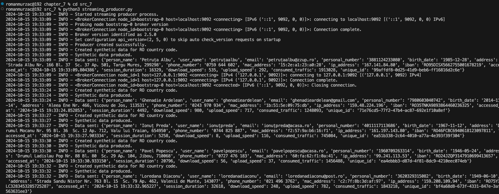

### Setup database
The database used will be the same as for batch processing - *drivendata_db*.

#### Prepare database
In database *drivendata_db* are already created schemas for batch processing that are deleted for now to not confuse the process. So, now it is available only *public* schema.
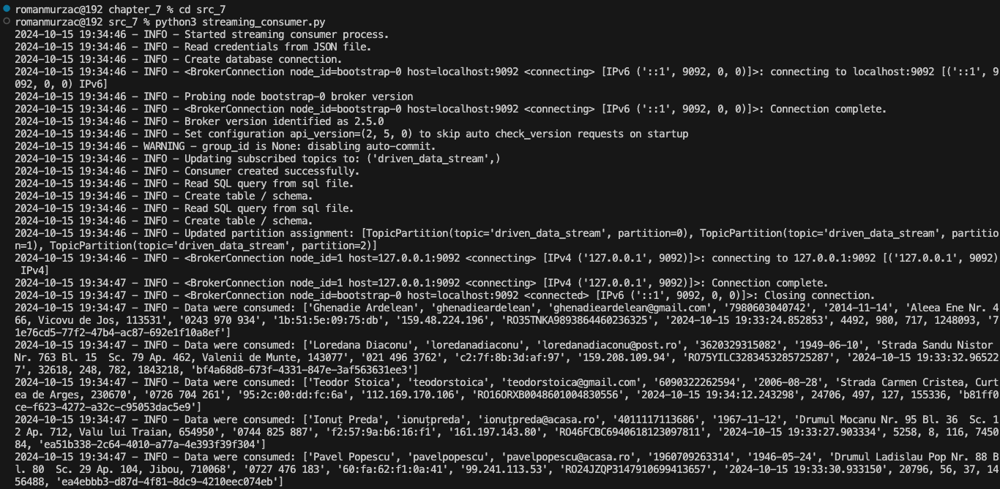

#### Check data
After running the *streaming_consumer.py* that also handle schema and table creation and start to ingest data in real-time the schema and the table are available in *pgAdmin 4*. Use query from below to see data in *streaming_data* table.
```
SELECT
    *
FROM
    streaming_layer.streaming_data
```


Use query from below to see the number of records in database in real-time.
```
SELECT
    COUNT(*) AS no_records
FROM
    streaming_layer.streaming_data
```
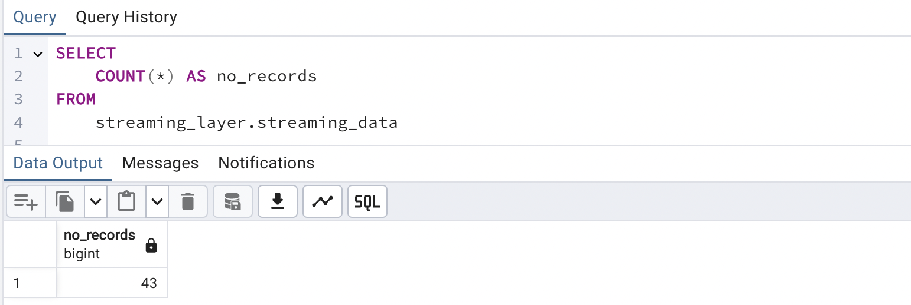

Run the same query again after few seconds, as each record is produced at interval of 1-15 seconds, and there should be constantly increasing number of records.


### Stop streaming
The streaming process is a continuous process, but because it was run locally it need to be stopped before exit from the development environment. To stop the streaming process use the command from below.
```
docker stop $(docker ps -q)
```
